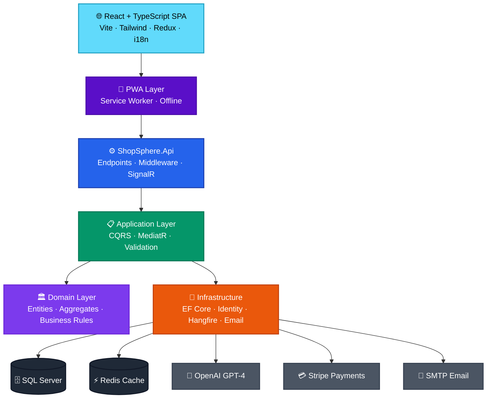
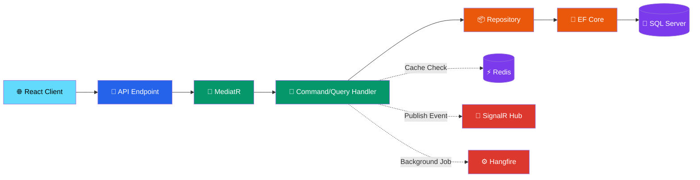

<p align="center">
  
</p>

<h1 align="center">ShopSphere</h1>

<p align="center">
  <em>Enterprise-Grade E-Commerce Platform with AI Integration</em>
  <br/>
  <em>ASP.NET Core 8 · Clean Architecture · CQRS · React · TypeScript · OpenAI · Stripe · SignalR</em>
</p>

<p align="center">
  <a href="#-overview">Overview</a> •
  <a href="#-key-features">Features</a> •
  <a href="#️-architecture">Architecture</a> •
  <a href="#️-technology-stack">Tech Stack</a> •
  <a href="#-getting-started">Getting Started</a> •
  <a href="#-documentation">Documentation</a>
</p>

<p align="center">
  
  
  
  
</p>

---

## 🚀 Backend Stack

<p align="center">
  
  
  
  
  
</p>

<p align="center">
  
  
  
  
  
</p>

## 💻 Frontend Stack

<p align="center">
  
  
  
  
  
</p>

<p align="center">
  
  
  
  
  
</p>

## 🤖 AI & Integrations

<p align="center">
  
  
  
  
</p>

## 🧪 Testing & DevOps

<p align="center">
  
  
  
  
</p>

---

## 📚 Table of Contents

- [🎯 Overview](#-overview)
- [✨ Key Features](#-key-features)
- [🎥 Demo & Screenshots](#-demo--screenshots)
- [🏗️ Architecture](#️-architecture)
- [📦 Solution Structure](#-solution-structure)
- [🛠️ Technology Stack](#️-technology-stack)
- [🎨 Frontend Pages](#-frontend-pages)
- [🔧 Engineering Practices](#-engineering-practices)
- [🚀 Getting Started](#-getting-started)
- [🐳 Docker Deployment](#-docker-deployment)
- [🌍 Internationalization](#-internationalization)
- [🤖 AI Features](#-ai-features)
- [📊 Project Status](#-project-status)
- [📖 Documentation](#-documentation)
- [🤝 Contributing](#-contributing)
- [📄 License](#-license)
- [👨‍💻 Author](#-author)

---

## 🎯 Overview

**ShopSphere** is a **production-ready, enterprise-grade e-commerce platform** engineered with modern .NET and React technologies. It showcases industry-standard software architecture patterns and integrates cutting-edge features including AI-powered assistance, real-time notifications, and multi-language support.

### 🌟 What Makes ShopSphere Special?

- 🏗️ **Enterprise Architecture** — Clean Architecture + CQRS + MediatR + Domain-Driven Design
- 🤖 **AI-Powered** — GPT-4 chatbot & AI product description generator
- 💳 **Real Payment Processing** — Full Stripe integration with webhooks
- 🔔 **Real-Time Updates** — SignalR-powered live notifications
- 🌍 **Global Ready** — 10+ languages with RTL support
- 📱 **PWA Enabled** — Installable app with offline support
- 🌙 **Dark Mode** — Beautiful themed UI
- 🐳 **Docker Ready** — Complete containerization setup
- 📊 **Analytics Dashboard** — Interactive charts with Recharts
---

## ✨ Key Features

### 🛒 Customer Experience

| Feature | Description |
|---------|-------------|
| 🔐 **Authentication** | JWT-based login with email verification & password reset |
| 🛍️ **Smart Product Search** | Server-side search with filters, sort, and pagination |
| 🆚 **Product Comparison** | Compare up to 4 products side-by-side |
| ❤️ **Wishlist** | Save favorites with add-to-cart quick action |
| 🛒 **Shopping Cart** | Coupon support with real-time price calculation |
| 💳 **Multi-Payment** | Stripe (Credit/Debit Cards), PayPal, Cash on Delivery |
| 📦 **Order Tracking** | Visual timeline with real-time status updates |
| ⭐ **Reviews & Ratings** | Product reviews with admin moderation |
| 🤖 **AI Assistant** | GPT-4 powered shopping chatbot |
| 🔔 **Live Notifications** | SignalR real-time order & promotion alerts |
| 📱 **PWA Support** | Install as mobile app with offline capabilities |
| 🌍 **Multi-Language** | 10+ languages including RTL (Arabic) |
| 🌙 **Dark Mode** | Toggle between light and dark themes |

### 👨‍💼 Admin Panel

| Feature | Description |
|---------|-------------|
| 📊 **Analytics Dashboard** | Sales charts, order distribution, KPIs with Recharts |
| 📦 **Product Management** | CRUD with multiple image uploads |
| ✍️ **AI Description Generator** | GPT-powered product copy generation |
| 🏷️ **Category & Brand Management** | Full CRUD with hierarchical categories |
| 📋 **Order Management** | Status workflow (Pending → Delivered → Completed) |
| 💰 **Payment Management** | Approve, refund, and mark payments |
| 📦 **Inventory Control** | Stock adjustments with transaction history |
| 🎫 **Coupon System** | Percentage/fixed discounts with expiry dates |
| ⭐ **Review Moderation** | Approve/reject customer reviews |
| 📈 **Sales Analytics** | 7D/14D/30D revenue trends |

---

## 🎥 Demo & Screenshots

<details>
<summary><b>📸 View Screenshots</b></summary>

### Customer Views
- 🏠 [Home Page](docs/screenshots/home.png)
- 🛍️ [Product Catalog](docs/screenshots/products.png)
- 🛒 [Shopping Cart](docs/screenshots/cart.png)
- 💳 [Checkout](docs/screenshots/checkout.png)
- 🤖 [AI Chatbot](docs/screenshots/chatbot.png)
- 🌙 [Dark Mode](docs/screenshots/dark-mode.png)

### Admin Views
- 📊 [Dashboard](docs/screenshots/admin-dashboard.png)
- 📈 [Analytics](docs/screenshots/analytics.png)
- 📦 [Order Management](docs/screenshots/admin-orders.png)
- 🏷️ [Product Management](docs/screenshots/admin-products.png)

</details>

---

## 🏗️ Architecture

### System Architecture



### Request Flow (CQRS Pattern)



### Clean Architecture Layers

| Layer | Responsibility | Dependencies |
|-------|----------------|--------------|
| **🎨 Presentation (API)** | HTTP endpoints, middleware, Swagger, SignalR hubs | Application |
| **📋 Application** | CQRS handlers, validators, business orchestration | Domain |
| **🏛️ Domain** | Entities, aggregates, value objects, domain events | None (Pure) |
| **🔧 Infrastructure** | EF Core, Identity, external services, background jobs | Application, Domain |

> **📐 Dependency Rule:** Dependencies flow strictly inward. Domain has zero external dependencies.

---

## 📦 Solution Structure

```text
ShopSphere/
│
├── 🎯 src/
│   ├── ShopSphere.Api/                 # Presentation Layer
│   │   ├── Endpoints/                  # Minimal API endpoints
│   │   ├── Hubs/                       # SignalR hubs
│   │   ├── Middlewares/                # Custom middleware
│   │   └── Extensions/                 # DI extensions
│   │
│   ├── ShopSphere.Application/         # Application Layer
│   │   ├── Features/                   # CQRS Commands & Queries
│   │   │   ├── Orders/
│   │   │   ├── Products/
│   │   │   └── ...
│   │   ├── Behaviors/                  # MediatR pipeline behaviors
│   │   └── Common/                     # Shared abstractions
│   │
│   ├── ShopSphere.Domain/              # Domain Layer (Pure)
│   │   ├── Entities/                   # Domain entities
│   │   ├── Aggregates/                 # Aggregate roots
│   │   ├── ValueObjects/               # Value objects
│   │   ├── Enums/                      # Domain enums
│   │   ├── Events/                     # Domain events
│   │   └── Interfaces/                 # Repository contracts
│   │
│   ├── ShopSphere.Infrastructure/      # Infrastructure Layer
│   │   ├── Persistence/                # EF Core, DbContext
│   │   ├── Identity/                   # ASP.NET Identity
│   │   ├── AI/                         # OpenAI service
│   │   ├── Payments/                   # Stripe service
│   │   ├── Notifications/              # SignalR + Email
│   │   ├── BackgroundJobs/             # Hangfire jobs
│   │   └── Repositories/               # Repository implementations
│   │
│   └── ShopSphere.Contracts/           # Shared Contracts
│       ├── Common/                     # ApiResponse, Result
│       ├── AI/                         # AI DTOs
│       └── Errors/                     # Error codes
│
├── 🧪 tests/
│   ├── ShopSphere.ApplicationTests/    # Handler & business logic tests
│   ├── ShopSphere.InfrastructureTests/ # Repository tests
│   ├── ShopSphere.ArchitectureTests/   # Architecture boundary tests
│   └── ShopSphere.IntegrationTests/    # End-to-end API tests
│
├── 💻 frontend/                         # React + TypeScript SPA
│   ├── src/
│   │   ├── api/                        # Axios API clients (per domain)
│   │   ├── components/
│   │   │   ├── ui/                     # Reusable UI (Button, Input, etc.)
│   │   │   ├── layout/                 # Navbar, Footer, Layout
│   │   │   └── features/               # Feature components (Chatbot, etc.)
│   │   ├── hooks/                      # Custom hooks (useAuth, useCart)
│   │   ├── pages/                      # Page components
│   │   │   └── admin/                  # Admin panel pages
│   │   ├── redux/                      # Redux Toolkit store
│   │   ├── i18n/                       # Translation files (10+ languages)
│   │   ├── types/                      # TypeScript definitions
│   │   └── utils/                      # Utilities
│   ├── public/
│   │   ├── favicon.svg
│   │   └── pwa-icons/                  # PWA icons
│   └── vite.config.ts                  # Vite + PWA config
│
├── 🗄️ database/                         # SQL Scripts
│   ├── 00_SeedData.sql
│   ├── 01_Roles.sql
│   └── ... (14 seed files)
│
├── 🐳 docker-compose.yml               # Multi-container orchestration
├── 📚 docs/                             # Documentation & screenshots
│
└── ⚙️ .github/
    └── workflows/                      # CI/CD pipelines
```

---

## 🛠️ Technology Stack

### 🖥️ Backend

<table>
<tr>
<td>

**Core Framework**
- ASP.NET Core 8
- C# 12
- .NET 8 SDK

**Data & ORM**
- Entity Framework Core 8
- SQL Server 2019+
- Repository Pattern

**Architecture**
- Clean Architecture
- CQRS + MediatR
- Domain-Driven Design
- SOLID Principles

</td>
<td>

**Authentication**
- ASP.NET Identity
- JWT Bearer Tokens
- Email Verification
- Password Reset

**Real-Time & Jobs**
- SignalR (WebSockets)
- Hangfire (Background Jobs)
- Redis (Distributed Cache)

**Integrations**
- OpenAI GPT-4 API
- Stripe Payments
- SMTP Email

</td>
</tr>
</table>

### 💻 Frontend

<table>
<tr>
<td>

**Core**
- React 18
- TypeScript 5
- Vite (Build Tool)
- React Router v6

**State Management**
- Redux Toolkit
- React Context

**Styling**
- Tailwind CSS v3
- Lucide React (Icons)
- Custom Design System

</td>
<td>

**Forms & Validation**
- React Hook Form
- Zod Schemas

**Data Fetching**
- Axios (with interceptors)
- Custom API layer

**Advanced Features**
- Recharts (Analytics)
- i18next (10+ languages)
- PWA (Vite Plugin)
- @microsoft/signalr

</td>
</tr>
</table>

### 🔧 DevOps & Testing

| Category | Tools |
|----------|-------|
| **Testing** | xUnit · Moq · FluentAssertions |
| **API Docs** | Swagger / OpenAPI |
| **Logging** | Serilog (Structured) |
| **Health Checks** | ASP.NET HealthChecks |
| **CI/CD** | GitHub Actions |
| **Containerization** | Docker + Docker Compose |
| **Rate Limiting** | Built-in ASP.NET |

---

## 🎨 Frontend Pages

### 🛒 Customer Pages

| Page | Route | Auth Required |
|------|-------|:-------------:|
| 🏠 Home | `/` | ❌ |
| 🛍️ Products | `/products` | ❌ |
| 📄 Product Detail | `/products/:id` | ❌ |
| 🆚 Compare Products | `/compare` | ❌ |
| 🛒 Shopping Cart | `/cart` | ✅ |
| 💳 Checkout | `/checkout` | ✅ |
| 💰 Payment | `/orders/:id/payment` | ✅ |
| 📦 My Orders | `/orders` | ✅ |
| 📄 Order Detail | `/orders/:id` | ✅ |
| ❤️ Wishlist | `/wishlist` | ✅ |
| 👤 Profile | `/profile` | ✅ |
| 📍 Addresses | `/addresses/new` | ✅ |

### 🔐 Authentication Pages

| Page | Route |
|------|-------|
| 🔑 Login | `/login` |
| ✍️ Register | `/register` |
| 📧 Verify Email | `/verify-email` |
| 🔐 Forgot Password | `/forgot-password` |
| 🔓 Reset Password | `/reset-password` |

### 📚 Info Pages

| Page | Route |
|------|-------|
| ❓ FAQ | `/faq` |
| 📞 Contact Us | `/contact` |
| ↩️ Returns Policy | `/returns` |

### 👨‍💼 Admin Panel

| Page | Route |
|------|-------|
| 📊 Dashboard | `/admin/dashboard` |
| 📈 Analytics | `/admin/analytics` |
| 📋 Manage Orders | `/admin/orders` |
| 📦 Manage Products | `/admin/products` |
| 🖼️ Product Images | `/admin/products/:id/images` |
| 📊 Manage Inventory | `/admin/inventory` |
| 🏷️ Manage Categories | `/admin/categories` |
| 🏆 Manage Brands | `/admin/brands` |
| 🎫 Manage Coupons | `/admin/coupons` |
| ⭐ Pending Reviews | `/admin/reviews` |

---

## 🔧 Engineering Practices

### 🏗️ Backend Best Practices

<table>
<tr>
<td>

**Architecture**
- ✅ Clean Architecture with strict boundaries
- ✅ CQRS Pattern (Commands + Queries)
- ✅ Repository & Unit of Work Pattern
- ✅ Domain-Driven Design concepts
- ✅ Dependency Injection throughout
- ✅ SOLID Principles

**Security**
- ✅ JWT Authentication
- ✅ Password hashing (Identity)
- ✅ Email verification workflow
- ✅ Password strength validation
- ✅ HTTPS enforcement
- ✅ Rate limiting (per user/IP)
- ✅ CORS configuration

</td>
<td>

**Data & Performance**
- ✅ EF Core with Migrations
- ✅ Audit Trail (via Interceptor)
- ✅ Soft Delete Pattern
- ✅ Redis Distributed Cache
- ✅ Query optimization
- ✅ Async/Await throughout

**Observability**
- ✅ Structured Logging (Serilog)
- ✅ Health Check Endpoints
- ✅ Request/Response logging
- ✅ Error tracking

**Testing**
- ✅ Unit Tests (xUnit)
- ✅ Integration Tests
- ✅ Architecture Tests
- ✅ FluentAssertions

</td>
</tr>
</table>

### 💻 Frontend Best Practices

<table>
<tr>
<td>

**Code Quality**
- ✅ TypeScript strict mode
- ✅ ESLint + Prettier
- ✅ Modular architecture
- ✅ Custom reusable hooks
- ✅ Composition over inheritance

**UI/UX**
- ✅ Responsive design (mobile-first)
- ✅ Dark mode support
- ✅ Accessibility (ARIA)
- ✅ Loading & error states
- ✅ Skeleton screens
- ✅ Toast notifications

</td>
<td>

**State Management**
- ✅ Redux Toolkit
- ✅ Async thunks
- ✅ Selector memoization
- ✅ Persistent storage

**Performance**
- ✅ Code splitting
- ✅ Lazy loading routes
- ✅ Image optimization
- ✅ Service worker caching
- ✅ Bundle optimization (Vite)

**Modern Features**
- ✅ PWA (Installable)
- ✅ Offline support
- ✅ Real-time updates (SignalR)
- ✅ i18n (10+ languages)

</td>
</tr>
</table>

---

## 🚀 Getting Started

### 📋 Prerequisites

| Tool | Version | Purpose |
|------|:-------:|---------|
| .NET SDK | 8.0+ | Backend framework |
| SQL Server | 2019+ | Database |
| Redis | 7.0+ | Cache & sessions |
| Node.js | 18+ | Frontend runtime |
| npm | 9+ | Package manager |
| Docker (optional) | 24+ | Containerization |

### 🔧 Backend Setup

```bash
# 1. Clone the repository
git clone https://github.com/chintanchhapgar/ShopSphere.git
cd ShopSphere

# 2. Setup user secrets (recommended)
cd src/ShopSphere.Api
dotnet user-secrets init

dotnet user-secrets set "ConnectionStrings:DefaultConnection" "Server=localhost;Database=ShopSphere;Trusted_Connection=True;TrustServerCertificate=True;"
dotnet user-secrets set "ConnectionStrings:Redis" "localhost:6379"
dotnet user-secrets set "Jwt:SecretKey" "your-super-secret-key-min-32-chars"
dotnet user-secrets set "OpenAI:ApiKey" "sk-your-openai-key"
dotnet user-secrets set "Stripe:SecretKey" "sk_test_your-stripe-key"
dotnet user-secrets set "Stripe:PublishableKey" "pk_test_your-stripe-key"

# 3. Run database migrations
cd ../..
dotnet ef database update --project src/ShopSphere.Infrastructure

# 4. (Optional) Run seed scripts from database/ folder in order (00 → 14)

# 5. Start the backend
dotnet run --project src/ShopSphere.Api
```

### 📡 Backend Endpoints

| Service | URL |
|---------|-----|
| 🚀 API | `https://localhost:7065` |
| 📖 Swagger UI | `https://localhost:7065/swagger` |
| ❤️ Health Check | `https://localhost:7065/health` |
| 📊 Health Dashboard | `https://localhost:7065/health-ui` |
| ⚙️ Hangfire Dashboard | `https://localhost:7065/hangfire` |
| 🔔 SignalR Hub | `wss://localhost:7065/hubs/notifications` |

### 💻 Frontend Setup

```bash
# 1. Navigate to frontend
cd frontend

# 2. Install dependencies
npm install

# 3. Create environment file
cat > .env << EOF
VITE_API_URL=https://localhost:7065/api
VITE_APP_NAME=ShopSphere
VITE_STRIPE_PUBLISHABLE_KEY=pk_test_your-key
EOF

# 4. Start development server
npm run dev

# 🌐 Open: http://localhost:3000
```

## 🌍 Internationalization

ShopSphere supports **10+ languages** with full RTL support:

| Language | Native Name | Code | RTL |
|----------|-------------|:----:|:---:|
| 🇬🇧 English | English | en | - |
| 🇮🇳 Hindi | हिन्दी | hi | - |
| 🇮🇳 Gujarati | ગુજરાતી | gu | - |
| 🇪🇸 Spanish | Español | es | - |
| 🇫🇷 French | Français | fr | - |
| 🇩🇪 German | Deutsch | de | - |
| 🇸🇦 Arabic | العربية | ar | ✅ |
| 🇨🇳 Chinese | 中文 | zh | - |
| 🇯🇵 Japanese | 日本語 | ja | - |
| 🇵🇹 Portuguese | Português | pt | - |

**Features:**
- ✅ Auto-detect browser language
- ✅ Persistent selection
- ✅ RTL layout for Arabic
- ✅ Custom fonts per language
- ✅ Searchable language switcher

---

## 🤖 AI Features

### 🎯 AI Shopping Assistant (Chatbot)

Floating chatbot on all pages powered by **OpenAI GPT-4**:

- 💬 Natural language product search
- 🎯 Personalized recommendations
- ❓ Order status inquiries
- 🛒 Add to cart from chat
- 🕐 Real-time responses
- 💾 Conversation history

**Example queries:**
- "Find me a smartphone under ₹80,000"
- "I need a laptop for programming"
- "What running shoes do you have?"
- "Show me kitchen appliances"

### ✍️ AI Product Description Generator (Admin)

Auto-generate SEO-optimized product descriptions:

- 📝 60-100 word descriptions
- 🎯 Category & brand-aware
- 💡 Highlights key features
- ⚡ One-click generation
- 🎨 Professional copy

---

## 📊 Project Status

### 🖥️ Backend

<details>
<summary><b>View Backend Status</b></summary>

| Module | Status | Notes |
|--------|:------:|-------|
| Authentication & Authorization | ✅ | JWT + Identity |
| Product Catalog | ✅ | Full CRUD + Search |
| Inventory Management | ✅ | Stock tracking + history |
| Shopping Cart + Coupons | ✅ | Real-time calculations |
| Order Processing | ✅ | Full lifecycle |
| Payment Workflow | ✅ | Stripe + COD |
| Wishlist | ✅ | Add/Remove/Move to cart |
| Reviews & Ratings | ✅ | With moderation |
| Shipments | ✅ | Tracking support |
| AI Integration | ✅ | OpenAI GPT-4 |
| Real-time Notifications | ✅ | SignalR |
| Background Jobs | ✅ | Hangfire |
| Email Notifications | ✅ | SMTP templates |
| Health Checks | ✅ | Multiple probes |
| Rate Limiting | ✅ | Per role |
| Unit Tests | ✅ | xUnit + Moq |
| Integration Tests | 🚧 | In progress |
| Docker Support | ✅ | Multi-container |
| CI/CD Pipeline | ✅ | GitHub Actions |
| Azure Deployment | 📅 | Planned |

</details>

### 💻 Frontend

<details>
<summary><b>View Frontend Status</b></summary>

| Feature | Status | Notes |
|---------|:------:|-------|
| Home Page | ✅ | Categories + Brands + Products |
| Product Catalog | ✅ | Server-side search |
| Product Detail | ✅ | Images + Reviews + Wishlist |
| Product Comparison | ✅ | Up to 4 products |
| Shopping Cart | ✅ | With coupon support |
| Checkout Flow | ✅ | Multi-step |
| Payment Integration | ✅ | Stripe + COD |
| Order Tracking | ✅ | With timeline |
| Wishlist | ✅ | Global sync |
| User Profile | ✅ | Complete dashboard |
| Address Management | ✅ | Full CRUD |
| Authentication Flow | ✅ | JWT with refresh |
| Admin Dashboard | ✅ | With charts |
| Admin Analytics | ✅ | Recharts |
| Admin Product Management | ✅ | CRUD + Images |
| Admin Order Management | ✅ | Status workflow |
| Admin Inventory | ✅ | Adjust + History |
| Admin Categories/Brands | ✅ | Full CRUD |
| Admin Coupons | ✅ | Create/Manage |
| Admin Reviews | ✅ | Approve/Reject |
| AI Chatbot | ✅ | GPT-4 integration |
| AI Description Generator | ✅ | Admin panel |
| Real-time Notifications | ✅ | SignalR |
| Multi-Language | ✅ | 10 languages |
| Dark Mode | ✅ | System + manual |
| PWA Support | ✅ | Installable |
| Offline Support | ✅ | Service worker |

</details>

---

## 📖 Documentation

| Document | Description |
|----------|-------------|
| 📘 [Authentication](docs/authentication.md) | JWT setup, Identity, verification & reset |
| 📘 [Catalog](docs/catalog.md) | Categories, brands, products |
| 📘 [Inventory](docs/inventory.md) | Stock management & transactions |
| 📘 [Orders](docs/orders.md) | Cart, checkout, order lifecycle |
| 📘 [Payments](docs/payments.md) | Stripe integration & webhooks |
| 📘 [AI Features](docs/ai-features.md) | OpenAI setup & usage |
| 📘 [Real-time](docs/signalr.md) | SignalR configuration |
| 📘 [Background Jobs](docs/background-jobs.md) | Hangfire jobs |
| 📘 [Testing](docs/testing.md) | Testing strategy |
| 📘 [Docker](docs/docker.md) | Container deployment |
| 📘 [i18n](docs/i18n.md) | Adding languages |
| 📘 [PWA](docs/pwa.md) | PWA configuration |
| 📘 [Roadmap](docs/roadmap.md) | Future features |

---

## 📄 License

This project is licensed under the **MIT License** — see the [LICENSE](LICENSE) file for details.

```
MIT License - You are free to use, modify, and distribute this software.
```

---

## 👨‍💻 Author

<p align="center">
  <strong>Chintan Chhapgar</strong>
  <br/>
  <em>Senior Full-Stack Developer | .NET · React · AI</em>
  <br/>
  <em>9+ Years of Enterprise Development Experience</em>
</p>

<p align="center">
  <a href="https://github.com/chintanchhapgar">
    
  </a>
  &nbsp;
  <a href="https://www.linkedin.com/in/chintanchhapgar/">
    
  </a>
  &nbsp;
  <a href="mailto:chintanchhapgar@gmail.com">
    
  </a>
</p>

<p align="center">
  <em>💼 Available for freelance projects & consulting</em>
  <br/>
  <em>🌟 Specializing in Enterprise .NET & React Applications with AI Integration</em>
</p>

---

<p align="center">
  <strong>🚀 Built with Excellence · Engineered for Scale · Designed for Success 🚀</strong>
</p>

<p align="center">
  <sub>© 2025 Chintan Chhapgar. Made with ❤️ using .NET 8, React & AI</sub>
</p>