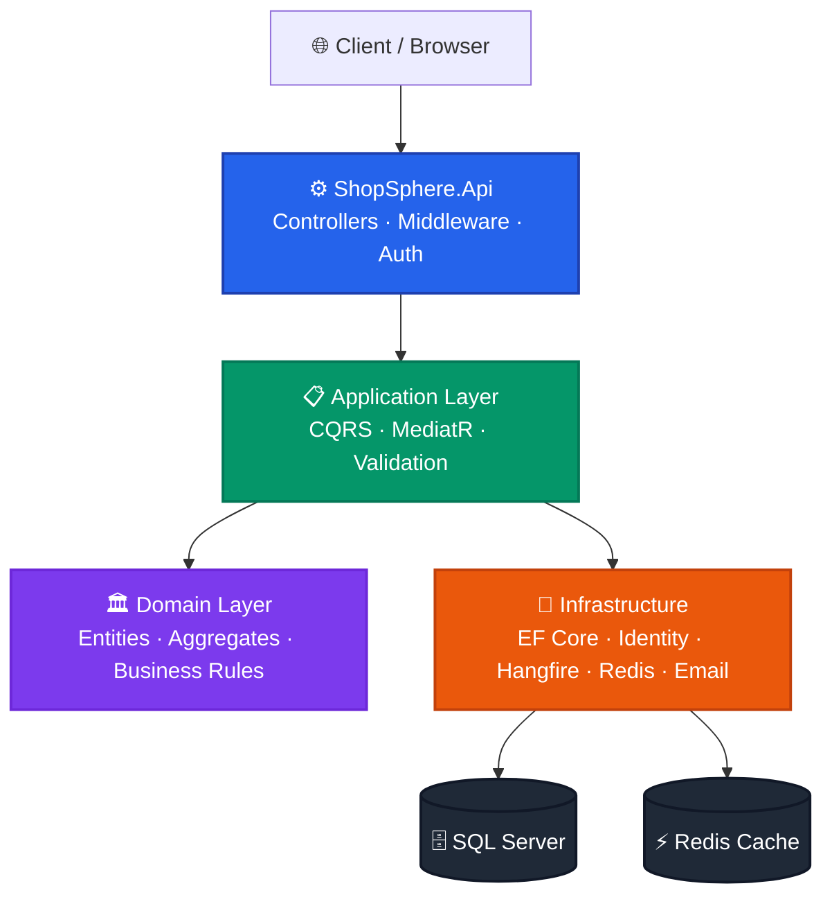
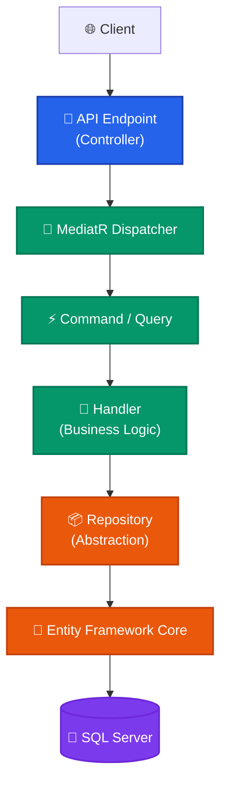

<p align="center">
  
</p>

<h1 align="center">ShopSphere</h1>

<p align="center">
  <em>Enterprise Multi-Vendor E-Commerce Backend — ASP.NET Core 8 · Clean Architecture · CQRS · MediatR · EF Core · JWT · Hangfire · Redis</em>
</p>

<p align="center">
  
  
  
  
</p>

<p align="center">
  
  
  
  
</p>

<p align="center">
  
  
  
  
</p>

<p align="center">
  
</p>

---

## Table of Contents

- [Overview](#overview)
- [Highlights](#highlights)
- [Project Status](#project-status)
- [Architecture Overview](#architecture-overview)
- [Solution Structure](#solution-structure)
- [Clean Architecture Layers](#clean-architecture-layers)
- [Request Flow](#request-flow)
- [Modules](#modules)
- [Technology Stack](#technology-stack)
- [Engineering Practices](#engineering-practices)
- [Documentation](#documentation)
- [License](#license)
- [Author](#author)

---

## Overview

**ShopSphere** is a production-ready, enterprise-grade multi-vendor e-commerce backend engineered with modern .NET technologies and industry-standard software architecture patterns.

Designed as a portfolio-quality reference implementation, ShopSphere demonstrates scalable system design, clean code principles, and real-world backend engineering practices employed in commercial-grade applications — covering everything from authentication and catalog management to background job processing, distributed caching, and automated CI/CD pipelines.

---

## Highlights

| Capability | Details |
|---|---|
| **Authentication & Identity** | JWT Bearer Tokens · ASP.NET Identity · Email Verification · Password Reset |
| **Product Catalog** | Categories · Brands · Products · Product Images |
| **Inventory Management** | Stock Tracking · Inventory Transactions |
| **Order Processing** | Shopping Cart · Checkout · Order Lifecycle |
| **Payment Workflow** | Payment Initiation · Status Management |
| **Notifications** | Templated Email Notifications · Background Delivery |
| **Background Processing** | Hangfire-powered Job Scheduling & Execution |
| **Architecture** | Clean Architecture · CQRS · MediatR · Repository Pattern |
| **Testing** | Unit · Integration · Architecture Tests |
| **DevOps & CI/CD** | GitHub Actions Automated Build & Test Pipeline |
| **Observability** | Serilog Structured Logging · Health Check Endpoints |
| **Performance** | Redis Distributed Cache · API Rate Limiting |

---

## Project Status

| Module | Status |
|---|:---:|
| Authentication & Authorization | ✅ Complete |
| Product Catalog | ✅ Complete |
| Inventory Management | ✅ Complete |
| Shopping Cart | ✅ Complete |
| Order Processing | ✅ Complete |
| Payment Workflow | ✅ Complete |
| Background Jobs | ✅ Complete |
| Email Notifications | ✅ Complete |
| Health Checks | ✅ Complete |
| Unit Tests | ✅ Complete |
| Integration Tests | 🚧 In Progress |
| Docker Support | 📅 Planned |
| Azure Deployment | 📅 Planned |

---

## Architecture Overview



---

## Solution Structure

```text
ShopSphere/
│
├── src/
│   ├── ShopSphere.Api                  # Presentation layer — Controllers, Middleware, Configuration
│   ├── ShopSphere.Application          # Application layer — CQRS, Commands, Queries, Validators
│   ├── ShopSphere.Domain               # Domain layer — Entities, Aggregates, Domain Events
│   └── ShopSphere.Infrastructure       # Infrastructure — EF Core, Identity, Hangfire, Redis, Email
│
├── tests/
│   ├── ShopSphere.ApplicationTests     # Unit tests — Handlers, Validators, Business Logic
│   ├── ShopSphere.InfrastructureTests  # Infrastructure unit tests
│   ├── ShopSphere.ArchitectureTests    # Architecture boundary enforcement tests
│   └── ShopSphere.IntegrationTests     # End-to-end API integration tests
│
├── docs/                               # Technical documentation and guides
│
└── .github/
    └── workflows/                      # GitHub Actions CI/CD pipelines
```

---

## Clean Architecture Layers

| Layer | Responsibility |
|---|---|
| **API** | HTTP endpoints, request/response handling, authentication middleware, Swagger documentation |
| **Application** | Use cases, CQRS commands & queries, MediatR pipeline behaviors, FluentValidation |
| **Domain** | Core business entities, aggregates, domain rules, value objects — zero external dependencies |
| **Infrastructure** | Data persistence (EF Core), ASP.NET Identity, email delivery, Hangfire jobs, Redis cache |

> **Dependency Rule:** Dependencies flow strictly inward. The Domain layer has no external dependencies. The Application layer depends only on the Domain. Infrastructure and API layers depend on Application — never the reverse.

---

## Request Flow



---

## Modules

| Module | Status |
|---|:---:|
| Authentication | ✅ |
| Authorization | ✅ |
| Categories | ✅ |
| Brands | ✅ |
| Products | ✅ |
| Product Images | ✅ |
| Inventory | ✅ |
| Shopping Cart | ✅ |
| Orders | ✅ |
| Payments | ✅ |
| Email Notifications | ✅ |
| Background Jobs | ✅ |
| Health Checks | ✅ |
| Rate Limiting | ✅ |
| API Documentation (Swagger) | ✅ |
| Structured Logging (Serilog) | ✅ |
| Unit Tests | ✅ |
| Integration Tests | 🚧 |
| CI/CD Pipeline | ✅ |

---

## Technology Stack

| Category | Technology |
|---|---|
| **Framework** | ASP.NET Core 8 |
| **Language** | C# 12 |
| **ORM** | Entity Framework Core 8 |
| **Database** | Microsoft SQL Server |
| **Authentication** | ASP.NET Identity · JWT Bearer |
| **Validation** | FluentValidation |
| **Mediator / CQRS** | MediatR |
| **Background Jobs** | Hangfire |
| **Distributed Cache** | Redis |
| **Logging** | Serilog |
| **API Documentation** | Swagger / OpenAPI |
| **Testing** | xUnit · Moq · FluentAssertions |
| **CI/CD** | GitHub Actions |

---

## Engineering Practices

- ✅ Clean Architecture with strict layer separation
- ✅ CQRS Pattern (Commands & Queries via MediatR)
- ✅ Repository & Unit of Work Pattern
- ✅ Dependency Injection throughout
- ✅ SOLID Principles
- ✅ Domain-Driven Design concepts
- ✅ JWT Authentication & Refresh Tokens
- ✅ Email Verification & Password Reset Workflows
- ✅ Background Job Processing
- ✅ Distributed Cache Strategy (Redis)
- ✅ API Rate Limiting
- ✅ Structured Logging & Observability
- ✅ Health Check Endpoints
- ✅ Unit, Integration & Architecture Testing
- ✅ Automated CI/CD via GitHub Actions

---

## Documentation

| Document | Description |
|---|---|
| [Authentication](docs/authentication.md) | JWT configuration, Identity setup, email verification & password reset |
| [Catalog](docs/catalog.md) | Categories, brands & product management |
| [Inventory](docs/inventory.md) | Stock management & inventory transactions |
| [Orders](docs/orders.md) | Shopping cart, checkout & order lifecycle |
| [Background Jobs](docs/background-jobs.md) | Hangfire configuration & job definitions |
| [Testing](docs/testing.md) | Testing strategy, structure & execution guide |
| [Deployment](docs/deployment.md) | Local development & production deployment setup |
| [Roadmap](docs/roadmap.md) | Planned features & future enhancements |

---

## License

This project is licensed under the **MIT License** — see the [LICENSE](LICENSE) file for details.

---

## Author

<p align="center">
  <strong>Chintan Chhapgar</strong>
  <br/><br/>
  <a href="https://github.com/chintanchhapgar">
    
  </a>
  &nbsp;
  <a href="https://www.linkedin.com/in/chintanchhapgar/">
    
  </a>
</p>

---

<p align="center">
  <sub>Built with precision · Engineered for scale · Designed for clarity</sub>
</p>
