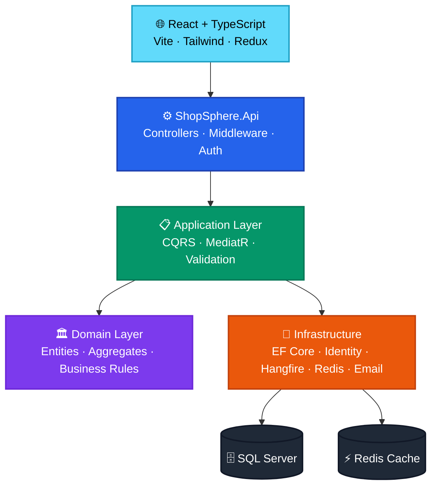
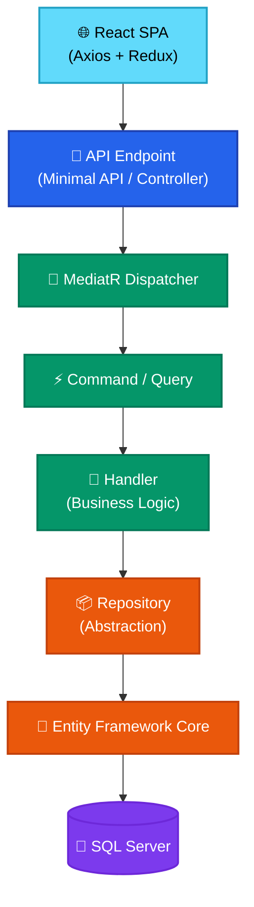

<p align="center">
  
</p>

<h1 align="center">ShopSphere</h1>

<p align="center">
  <em>Production-Ready Multi-Vendor E-Commerce Platform — ASP.NET Core 8 · Clean Architecture · CQRS · MediatR · React · TypeScript · EF Core · JWT · Hangfire · Redis</em>
</p>

<p align="center">
  
  
  
  
</p>

<p align="center">
  
  
  
  
</p>

<p align="center">
  
  
  
  
</p>

<p align="center">
  
  
  
  
</p>

<p align="center">
  
  
</p>

<p align="center">
  
</p>

---

## Table of Contents

- [Overview](#overview)
- [Highlights](#highlights)
- [Project Status](#project-status)
- [Architecture Overview](#architecture-overview)
- [Solution Structure](#solution-structure)
- [Clean Architecture Layers](#clean-architecture-layers)
- [Request Flow](#request-flow)
- [Modules](#modules)
- [Technology Stack](#technology-stack)
- [Frontend Pages](#frontend-pages)
- [Engineering Practices](#engineering-practices)
- [Getting Started](#getting-started)
- [Documentation](#documentation)
- [License](#license)
- [Author](#author)

---

## Overview

**ShopSphere** is a production-ready, enterprise-grade multi-vendor e-commerce platform engineered with modern .NET and React technologies, following industry-standard software architecture patterns.

The platform consists of a **ASP.NET Core 8 REST API backend** built with Clean Architecture and CQRS, paired with a **React + TypeScript SPA frontend** featuring a professional UI/UX. Designed as a portfolio-quality reference implementation, ShopSphere demonstrates scalable system design, clean code principles, and real-world full-stack engineering practices — covering everything from authentication and catalog management to background job processing, distributed caching, and automated CI/CD pipelines.

---

## Highlights

| Capability | Details |
|---|---|
| **Authentication & Identity** | JWT Bearer Tokens · ASP.NET Identity · Email Verification · Password Reset |
| **Product Catalog** | Categories · Brands · Products · Product Images · Server-side Search & Filter |
| **Inventory Management** | Stock Tracking · Inventory Transactions · Low Stock Alerts |
| **Order Processing** | Shopping Cart · Coupon Support · Checkout · Order Lifecycle · Timeline |
| **Payment Workflow** | Payment Initiation · Status Management · Refunds |
| **Wishlist** | Add / Remove / Move to Cart |
| **Reviews & Ratings** | Customer Reviews · Admin Moderation (Approve / Reject) |
| **Notifications** | Templated Email Notifications · Background Delivery |
| **Background Processing** | Hangfire-powered Job Scheduling & Execution |
| **Architecture** | Clean Architecture · CQRS · MediatR · Repository Pattern |
| **Testing** | Unit · Integration · Architecture Tests |
| **DevOps & CI/CD** | GitHub Actions Automated Build & Test Pipeline |
| **Observability** | Serilog Structured Logging · Health Check Endpoints |
| **Performance** | Redis Distributed Cache · API Rate Limiting |
| **Frontend** | React 18 · TypeScript · Tailwind CSS · Redux Toolkit · Protected Routes |

---

## Project Status

### Backend
| Module | Status |
|---|:---:|
| Authentication & Authorization | ✅ Complete |
| Product Catalog | ✅ Complete |
| Inventory Management | ✅ Complete |
| Shopping Cart + Coupons | ✅ Complete |
| Order Processing | ✅ Complete |
| Payment Workflow | ✅ Complete |
| Wishlist | ✅ Complete |
| Reviews & Ratings | ✅ Complete |
| Shipments | ✅ Complete |
| Background Jobs | ✅ Complete |
| Email Notifications | ✅ Complete |
| Health Checks | ✅ Complete |
| Unit Tests | ✅ Complete |
| Integration Tests | 🚧 In Progress |
| Docker Support | 📅 Planned |
| Azure Deployment | 📅 Planned |

### Frontend
| Page / Feature | Status |
|---|:---:|
| Home (Categories, Brands, Featured Products) | ✅ Complete |
| Products (Search, Filter, Sort, Pagination) | ✅ Complete |
| Product Detail (Images, Reviews, Wishlist) | ✅ Complete |
| Cart (Coupon, Quantity, Summary) | ✅ Complete |
| Checkout (Address Selection, Payment) | ✅ Complete |
| Orders (List, Detail, Cancel, Timeline) | ✅ Complete |
| Wishlist | ✅ Complete |
| Profile (Overview, Orders, Addresses, Wishlist) | ✅ Complete |
| Address Management (CRUD) | ✅ Complete |
| Auth (Login, Register, Verify, Reset Password) | ✅ Complete |
| Admin Dashboard (Analytics, Charts) | ✅ Complete |
| Admin Orders (Status Transitions, Payments) | ✅ Complete |
| Admin Products (CRUD, Images) | ✅ Complete |
| Admin Inventory (Adjust, History) | ✅ Complete |
| Admin Categories & Brands | ✅ Complete |
| Admin Coupons | ✅ Complete |
| Admin Reviews (Approve / Reject) | ✅ Complete |
| FAQ, Contact, Returns | ✅ Complete |

---

## Architecture Overview



---

## Solution Structure

```text
ShopSphere/
│
├── src/
│   ├── ShopSphere.Api                  # Presentation layer — Endpoints, Middleware, Configuration
│   ├── ShopSphere.Application          # Application layer — CQRS, Commands, Queries, Validators
│   ├── ShopSphere.Domain               # Domain layer — Entities, Aggregates, Domain Events
│   ├── ShopSphere.Infrastructure       # Infrastructure — EF Core, Identity, Hangfire, Redis, Email
│   └── ShopSphere.Contracts            # Shared contracts — DTOs, Common responses
│
├── tests/
│   ├── ShopSphere.ApplicationTests     # Unit tests — Handlers, Validators, Business Logic
│   ├── ShopSphere.InfrastructureTests  # Infrastructure unit tests
│   ├── ShopSphere.ArchitectureTests    # Architecture boundary enforcement tests
│   └── ShopSphere.IntegrationTests     # End-to-end API integration tests
│
├── frontend/                           # React + TypeScript SPA
│   ├── src/
│   │   ├── api/                        # Axios API layer (per domain)
│   │   ├── components/                 # Reusable UI components
│   │   │   ├── ui/                     # Button, Input, Badge, Spinner, Card
│   │   │   ├── layout/                 # Navbar, Footer, Layout
│   │   │   └── features/               # ProductCard, SearchProductCard
│   │   ├── hooks/                      # useAuth, useCart, useWishlist
│   │   ├── pages/                      # All page components
│   │   │   └── admin/                  # Admin-only pages
│   │   ├── redux/                      # Store + slices (auth, cart, ui)
│   │   ├── types/                      # TypeScript interfaces & enums
│   │   └── utils/                      # cn, formatPrice, constants
│   └── public/
│       └── favicon.svg
│
├── database/                           # SQL seed scripts
│   ├── 00_SeedData.sql
│   ├── 01_Roles.sql
│   └── ...
│
├── docs/                               # Technical documentation
│
└── .github/
    └── workflows/                      # GitHub Actions CI/CD pipelines
```

---

## Clean Architecture Layers

| Layer | Responsibility |
|---|---|
| **API** | HTTP endpoints, request/response handling, authentication middleware, Swagger documentation |
| **Application** | Use cases, CQRS commands & queries, MediatR pipeline behaviors, FluentValidation |
| **Domain** | Core business entities, aggregates, domain rules, value objects — zero external dependencies |
| **Infrastructure** | Data persistence (EF Core), ASP.NET Identity, email delivery, Hangfire jobs, Redis cache |

> **Dependency Rule:** Dependencies flow strictly inward. The Domain layer has no external dependencies. The Application layer depends only on the Domain. Infrastructure and API layers depend on Application — never the reverse.

---

## Request Flow



---

## Modules

| Module | Backend | Frontend |
|---|:---:|:---:|
| Authentication & Authorization | ✅ | ✅ |
| Categories | ✅ | ✅ |
| Brands | ✅ | ✅ |
| Products | ✅ | ✅ |
| Product Images | ✅ | ✅ |
| Inventory | ✅ | ✅ |
| Shopping Cart + Coupons | ✅ | ✅ |
| Orders | ✅ | ✅ |
| Payments | ✅ | ✅ |
| Wishlist | ✅ | ✅ |
| Reviews & Ratings | ✅ | ✅ |
| Shipments | ✅ | 📅 |
| Address Management | ✅ | ✅ |
| Admin Dashboard | ✅ | ✅ |
| Email Notifications | ✅ | ✅ |
| Background Jobs | ✅ | — |
| Health Checks | ✅ | — |
| Rate Limiting | ✅ | — |
| API Documentation (Swagger) | ✅ | — |
| Structured Logging (Serilog) | ✅ | — |
| Unit Tests | ✅ | — |
| Integration Tests | 🚧 | — |
| CI/CD Pipeline | ✅ | — |

---

## Technology Stack

### Backend
| Category | Technology |
|---|---|
| **Framework** | ASP.NET Core 8 |
| **Language** | C# 12 |
| **ORM** | Entity Framework Core 8 |
| **Database** | Microsoft SQL Server |
| **Authentication** | ASP.NET Identity · JWT Bearer |
| **Validation** | FluentValidation |
| **Mediator / CQRS** | MediatR |
| **Background Jobs** | Hangfire |
| **Distributed Cache** | Redis |
| **Logging** | Serilog |
| **API Documentation** | Swagger / OpenAPI |
| **Testing** | xUnit · Moq · FluentAssertions |
| **CI/CD** | GitHub Actions |

### Frontend
| Category | Technology |
|---|---|
| **Framework** | React 18 |
| **Language** | TypeScript 5 |
| **Build Tool** | Vite |
| **Styling** | Tailwind CSS v3 |
| **State Management** | Redux Toolkit |
| **Routing** | React Router v6 |
| **Forms** | React Hook Form + Zod |
| **HTTP Client** | Axios (with interceptors) |
| **Icons** | Lucide React |
| **Notifications** | React Hot Toast |

---

## Frontend Pages

| Page | URL | Auth Required |
|---|---|:---:|
| Home | `/` | No |
| Products | `/products` | No |
| Product Detail | `/products/:id` | No |
| Cart | `/cart` | Yes |
| Checkout | `/checkout` | Yes |
| Payment | `/orders/:id/payment` | Yes |
| Orders | `/orders` | Yes |
| Order Detail | `/orders/:id` | Yes |
| Wishlist | `/wishlist` | Yes |
| Profile | `/profile` | Yes |
| Addresses | `/addresses/new` | Yes |
| Login | `/login` | No |
| Register | `/register` | No |
| Verify Email | `/verify-email` | No |
| Forgot Password | `/forgot-password` | No |
| Reset Password | `/reset-password` | No |
| FAQ | `/faq` | No |
| Contact | `/contact` | No |
| Returns Policy | `/returns` | No |
| Admin Dashboard | `/admin/dashboard` | Admin |
| Admin Orders | `/admin/orders` | Admin |
| Admin Products | `/admin/products` | Admin |
| Admin Inventory | `/admin/inventory` | Admin |
| Admin Categories | `/admin/categories` | Admin |
| Admin Brands | `/admin/brands` | Admin |
| Admin Coupons | `/admin/coupons` | Admin |
| Admin Reviews | `/admin/reviews` | Admin |

---

## Engineering Practices

### Backend
- ✅ Clean Architecture with strict layer separation
- ✅ CQRS Pattern (Commands & Queries via MediatR)
- ✅ Repository & Unit of Work Pattern
- ✅ Dependency Injection throughout
- ✅ SOLID Principles
- ✅ Domain-Driven Design concepts
- ✅ JWT Authentication
- ✅ Email Verification & Password Reset Workflows
- ✅ Audit Trail (CreatedAt, UpdatedAt, CreatedBy via EF Interceptor)
- ✅ Soft Delete Pattern
- ✅ Background Job Processing (Hangfire)
- ✅ Distributed Cache Strategy (Redis)
- ✅ API Rate Limiting
- ✅ Structured Logging & Observability
- ✅ Health Check Endpoints
- ✅ Unit, Integration & Architecture Testing
- ✅ Automated CI/CD via GitHub Actions

### Frontend
- ✅ TypeScript strict mode
- ✅ Reusable component library (Button, Input, Badge, Spinner, Card)
- ✅ Custom hooks (useAuth, useCart, useWishlist)
- ✅ Protected routes (customer + admin)
- ✅ Axios interceptors (JWT inject + 401 handle)
- ✅ Form validation with Zod schemas
- ✅ Password strength indicator
- ✅ Responsive design (mobile + tablet + desktop)
- ✅ Image URL resolution (relative → absolute)
- ✅ Error boundaries and loading states

---

## Getting Started

### Prerequisites

| Tool | Version |
|---|---|
| .NET SDK | 8.0+ |
| SQL Server | 2019+ |
| Redis | 7.0+ |
| Node.js | 18+ |
| npm | 9+ |

### Backend Setup

```bash
# Clone repository
git clone https://github.com/chintanchhapgar/ShopSphere.git
cd ShopSphere

# Update connection strings in appsettings.Development.json
# DefaultConnection: your SQL Server
# Redis: your Redis instance

# Run database migrations
dotnet ef database update --project src/ShopSphere.Infrastructure

# Run seed scripts (optional)
# Execute files in database/ folder in order (00 → 14)

# Start the API
dotnet run --project src/ShopSphere.Api
```

| Endpoint | URL |
|---|---|
| API | `https://localhost:7065` |
| Swagger | `https://localhost:7065/swagger` |
| Health | `https://localhost:7065/health` |
| Hangfire | `https://localhost:7065/hangfire` |
| Health UI | `https://localhost:7065/health-ui` |

### Frontend Setup

```bash
cd frontend

# Install dependencies
npm install

# Create environment file
echo "VITE_API_URL=https://localhost:7065/api" > .env
echo "VITE_APP_NAME=ShopSphere" >> .env

# Start development server
npm run dev
# App: http://localhost:3000
```

### Default Credentials

| Role | Email | Password |
|---|---|---|
| Admin | Set in seed data | Set in seed data |
| Customer | Register via `/register` | Your choice |

---

## Documentation

| Document | Description |
|---|---|
| [Authentication](docs/authentication.md) | JWT configuration, Identity setup, email verification & password reset |
| [Catalog](docs/catalog.md) | Categories, brands & product management |
| [Inventory](docs/inventory.md) | Stock management & inventory transactions |
| [Orders](docs/orders.md) | Shopping cart, checkout & order lifecycle |
| [Background Jobs](docs/background-jobs.md) | Hangfire configuration & job definitions |
| [Testing](docs/testing.md) | Testing strategy, structure & execution guide |
| [Deployment](docs/deployment.md) | Local development & production deployment setup |
| [Roadmap](docs/roadmap.md) | Planned features & future enhancements |

---

## License

This project is licensed under the **MIT License** — see the [LICENSE](LICENSE) file for details.

---

## Author

<p align="center">
  <strong>Chintan Chhapgar</strong>
  <br/><br/>
  <a href="https://github.com/chintanchhapgar">
    
  </a>
  &nbsp;
  <a href="https://www.linkedin.com/in/chintanchhapgar/">
    
  </a>
</p>

---

<p align="center">
  <sub>Built with precision · Engineered for scale · Designed for clarity</sub>
</p>