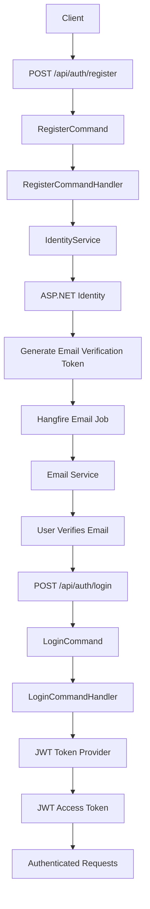
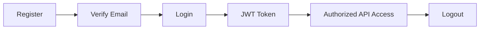

# Authentication

ShopSphere uses **JWT Bearer Authentication** with **ASP.NET Core Identity** and follows a secure authentication workflow including email verification, password reset, and role-based authorization.

---

## Table of Contents

- [Features](#features)
- [Authentication Flow](#authentication-flow)
- [Authentication Endpoints](#authentication-endpoints)
- [Register](#register)
- [Login](#login)
- [Current User](#current-user)
- [Verify Email](#verify-email)
- [Forgot Password](#forgot-password)
- [Reset Password](#reset-password)
- [JWT Authentication](#jwt-authentication)
- [Authorization](#authorization)
- [Background Processing](#background-processing)
- [Security Features](#security-features)
- [Authentication Lifecycle](#authentication-lifecycle)

---

## Features

| Feature | Status |
|---|:---:|
| User Registration | ✅ |
| JWT Authentication | ✅ |
| Email Verification | ✅ |
| Forgot Password | ✅ |
| Password Reset | ✅ |
| Current User Endpoint | ✅ |
| Role-Based Authorization | ✅ |
| Background Email Processing (Hangfire) | ✅ |

---

## Authentication Flow



---

## Authentication Endpoints

| Endpoint | Method | Auth Required | Description |
|---|:---:|:---:|---|
| `/api/auth/register` | `POST` | ❌ | Register a new user account |
| `/api/auth/login` | `POST` | ❌ | Authenticate and receive JWT token |
| `/api/auth/me` | `GET` | ✅ | Get current authenticated user |
| `/api/auth/verify-email` | `POST` | ❌ | Verify email address with token |
| `/api/auth/forgot-password` | `POST` | ❌ | Generate a password reset token |
| `/api/auth/reset-password` | `POST` | ❌ | Reset password using a valid token |

---

## Register

Creates a new user account.

### Endpoint

```
POST /api/auth/register
```

### Request Body

```json
{
  "firstName": "John",
  "lastName": "Doe",
  "email": "john@test.com",
  "password": "Password@123"
}
```

### Success Response

```json
{
  "success": true,
  "message": "Registration completed successfully."
}
```

### What happens after registration

- User account is created in the database
- Email verification token is generated
- Hangfire queues a background email verification job

---

## Login

Authenticates an existing user and returns a JWT access token.

### Endpoint

```
POST /api/auth/login
```

### Request Body

```json
{
  "email": "john@test.com",
  "password": "Password@123"
}
```

### Success Response

```json
{
  "success": true,
  "data": {
    "accessToken": "<jwt-token>",
    "expiresAt": "2026-07-20T12:00:00Z"
  }
}
```

---

## Current User

Returns the authenticated user's profile information.

### Endpoint

```
GET /api/auth/me
```

### Authorization Header

```
Authorization: Bearer <token>
```

### Success Response

```json
{
  "success": true,
  "data": {
    "id": "...",
    "email": "john@test.com",
    "firstName": "John",
    "lastName": "Doe",
    "roles": [
      "Customer"
    ]
  }
}
```

---

## Verify Email

Confirms the user's email address using the verification token.

### Endpoint

```
POST /api/auth/verify-email
```

### Request Body

```json
{
  "email": "john@test.com",
  "token": "<verification-token>"
}
```

### Success Response

```json
{
  "success": true,
  "message": "Email verified successfully."
}
```

### What happens after verification

- Email address is marked as verified
- A welcome email is queued via Hangfire background job

---

## Forgot Password

Generates a secure password reset token and sends it to the user's email.

### Endpoint

```
POST /api/auth/forgot-password
```

### Request Body

```json
{
  "email": "john@test.com"
}
```

### Success Response

```json
{
  "success": true,
  "message": "If an account exists with this email, a password reset link has been sent."
}
```

> **Security Note:** The API always returns the same response regardless of whether the email address exists — this prevents user enumeration attacks.

---

## Reset Password

Resets the user's password using a valid reset token.

### Endpoint

```
POST /api/auth/reset-password
```

### Request Body

```json
{
  "email": "john@test.com",
  "token": "<reset-token>",
  "newPassword": "NewPassword@123"
}
```

### Success Response

```json
{
  "success": true,
  "message": "Password reset successfully."
}
```

---

## JWT Authentication

ShopSphere uses **JWT Bearer Tokens** for stateless authentication.

### Token Payload

| Claim | Description |
|---|---|
| **User Id** | Unique user identifier |
| **Email** | User email address |
| **Roles** | Assigned user roles |
| **Expiration** | Token expiry timestamp |
| **JTI** | Unique JWT identifier |

### Authorization Header Format

```
Authorization: Bearer eyJhbGciOi...
```

---

## Authorization

Protected endpoints require a valid JWT Bearer token.

### Require Authentication

```csharp
[Authorize]
```

### Require Specific Role

```csharp
[Authorize(Roles = "Admin")]
```

### Role Hierarchy

| Role | Access Level |
|---|---|
| **Admin** | Full system access |
| **Vendor** | Vendor-specific operations |
| **Customer** | Standard customer operations |

---

## Background Processing

Authentication uses **Hangfire** for non-blocking email delivery, keeping API response times fast while ensuring reliable email operations.

| Job | Trigger |
|---|---|
| **Email Verification Job** | User registration |
| **Welcome Email Job** | Successful email verification |
| **Password Reset Email Job** | Forgot password request |

---

## Security Features

| Feature | Description |
|---|---|
| **ASP.NET Core Identity** | Industry-standard identity management |
| **Password Hashing** | Secure bcrypt-based password storage |
| **JWT Authentication** | Stateless token-based authentication |
| **Email Verification** | Ensures valid email ownership |
| **Secure Reset Tokens** | Time-limited password reset tokens |
| **Role-Based Authorization** | Fine-grained access control |
| **Background Email Processing** | Non-blocking Hangfire job queue |
| **Global Exception Handling** | No sensitive data exposed in errors |
| **Rate Limiting** | Prevents brute-force attacks |

---

## Authentication Lifecycle



---

<p align="center">
  <sub>Built with precision · Engineered for scale · Designed for clarity</sub>
</p>
