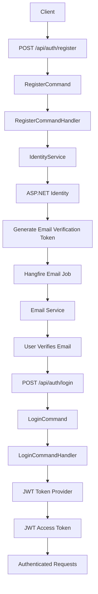
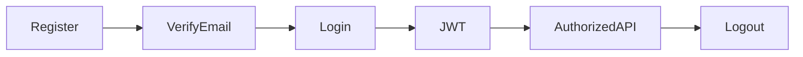

# Authentication

ShopSphere uses **JWT Bearer Authentication** with **ASP.NET Core Identity** and follows a secure authentication workflow including email verification, password reset, and role-based authorization.

---

# Features

- User Registration
- JWT Authentication
- Email Verification
- Forgot Password
- Password Reset
- Current User Endpoint
- Role-Based Authorization
- Background Email Processing (Hangfire)

---

# Authentication Flow



---

# Authentication Endpoints

| Endpoint | Method | Authentication | Description |
|----------|--------|----------------|-------------|
| `/api/auth/register` | POST | No | Register new user |
| `/api/auth/login` | POST | No | Authenticate user |
| `/api/auth/me` | GET | Yes | Get current user |
| `/api/auth/verify-email` | POST | No | Verify email address |
| `/api/auth/forgot-password` | POST | No | Generate password reset token |
| `/api/auth/reset-password` | POST | No | Reset password |

---

# Register

Creates a new user account.

## Endpoint

```
POST /api/auth/register
```

## Request

```json
{
  "firstName": "John",
  "lastName": "Doe",
  "email": "john@test.com",
  "password": "Password@123"
}
```

## Success Response

```json
{
  "success": true,
  "message": "Registration completed successfully."
}
```

After successful registration:

- User is created.
- Email verification token is generated.
- Hangfire queues an email verification job.

---

# Login

Authenticates an existing user.

## Endpoint

```
POST /api/auth/login
```

## Request

```json
{
  "email": "john@test.com",
  "password": "Password@123"
}
```

## Success Response

```json
{
  "success": true,
  "data": {
    "accessToken": "<jwt-token>",
    "expiresAt": "2026-07-20T12:00:00Z"
  }
}
```

---

# Current User

Returns the authenticated user's profile.

## Endpoint

```
GET /api/auth/me
```

## Authorization

```
Authorization: Bearer <token>
```

## Success Response

```json
{
  "success": true,
  "data": {
    "id": "...",
    "email": "john@test.com",
    "firstName": "John",
    "lastName": "Doe",
    "roles": [
      "Customer"
    ]
  }
}
```

---

# Verify Email

Confirms the user's email address.

## Endpoint

```
POST /api/auth/verify-email
```

## Request

```json
{
  "email": "john@test.com",
  "token": "<verification-token>"
}
```

## Success Response

```json
{
  "success": true,
  "message": "Email verified successfully."
}
```

After successful verification:

- Email is marked as verified.
- Welcome email is queued using Hangfire.

---

# Forgot Password

Generates a password reset token.

## Endpoint

```
POST /api/auth/forgot-password
```

## Request

```json
{
  "email": "john@test.com"
}
```

## Success Response

```json
{
  "success": true,
  "message": "If an account exists with this email, a password reset link has been sent."
}
```

> For security reasons, the API returns the same response even when the email address does not exist.

---

# Reset Password

Resets the user's password using a valid reset token.

## Endpoint

```
POST /api/auth/reset-password
```

## Request

```json
{
  "email": "john@test.com",
  "token": "<reset-token>",
  "newPassword": "NewPassword@123"
}
```

## Success Response

```json
{
  "success": true,
  "message": "Password reset successfully."
}
```

---

# JWT Authentication

ShopSphere uses **JWT Bearer Tokens**.

Each token contains:

- User Id
- Email
- Roles
- Expiration
- JWT ID (JTI)

Example Authorization header:

```
Authorization: Bearer eyJhbGciOi...
```

---

# Authorization

Protected endpoints require a valid JWT.

Example:

```csharp
[Authorize]
```

Role-based endpoints can use:

```csharp
[Authorize(Roles = "Admin")]
```

---

# Background Processing

Authentication uses Hangfire for non-blocking email operations.

Current jobs include:

- Email Verification
- Welcome Email
- Password Reset Email

This keeps API response times fast while ensuring reliable email delivery.

---

# Security Features

- ASP.NET Core Identity
- Password Hashing
- JWT Authentication
- Email Verification
- Secure Password Reset Tokens
- Role-Based Authorization
- Background Email Processing
- Global Exception Handling
- Rate Limiting

---

# Authentication Lifecycle

