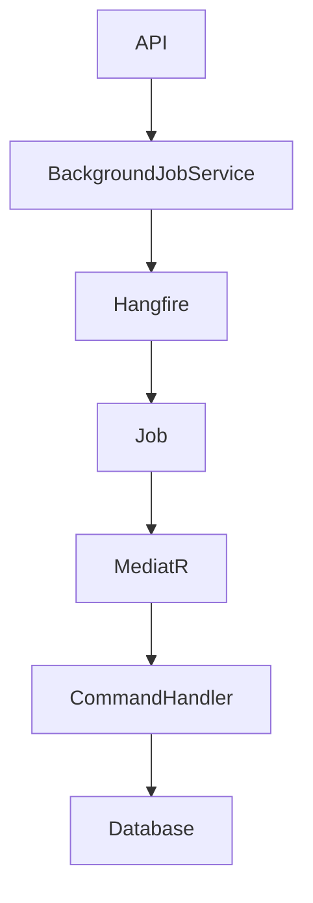
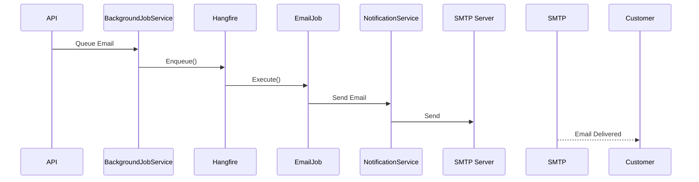

# Background Jobs

The Background Jobs module is responsible for executing asynchronous and scheduled tasks that should not block API requests. ShopSphere uses **Hangfire** to process recurring and fire-and-forget jobs such as order management, email notifications, and future maintenance tasks.

---

# Features

- Hangfire Integration
- Recurring Jobs
- Fire-and-Forget Jobs
- Email Processing
- Order Automation
- Automatic Retry
- Dashboard Monitoring
- Structured Logging
- Dependency Injection Support

---

# Architecture Overview



---

# Background Job Types

| Type | Purpose |
|------|---------|
| Fire-and-Forget | Execute once immediately |
| Recurring | Scheduled execution |
| Delayed | Execute after a delay |
| Continuation | Execute after another job |
| Batch *(Future)* | Multiple jobs together |

---

# Current Jobs

## CancelExpiredOrdersJob

Automatically cancels unpaid orders after the expiration period.

### Schedule

```text
Every Minute
```

### Workflow

```mermaid
flowchart LR

Hangfire

↓

CancelExpiredOrdersJob

↓

CancelExpiredOrdersCommand

↓

Order Repository

↓

SQL Server
```

---

## CompleteDeliveredOrdersJob

Marks delivered orders as completed after the configured period.

### Schedule

```text
Daily
```

### Workflow

```mermaid
flowchart LR

Hangfire

↓

CompleteDeliveredOrdersJob

↓

CompleteDeliveredOrdersCommand

↓

Order Repository

↓

SQL Server
```

---

# Email Jobs

The application queues emails instead of sending them during API requests.

Current email jobs include:

- Welcome Email
- Email Verification
- Password Reset
- Order Confirmation
- Payment Confirmation
- Shipment Notification
- Delivery Notification

---

# Email Workflow



---

# Hangfire Dashboard

The Hangfire Dashboard provides monitoring for:

- Scheduled Jobs
- Running Jobs
- Failed Jobs
- Processing Jobs
- Retry Attempts
- Job History

Default endpoint:

```text
/hangfire
```

---

# Dependency Injection

Jobs are registered through dependency injection.

```text
CancelExpiredOrdersJob

CompleteDeliveredOrdersJob

EmailJob
```

---

# Logging

Every background job records structured logs.

Examples:

```text
Job Started

Orders Cancelled

Orders Completed

Email Sent

Job Failed
```

Logs are captured using **Serilog**.

---

# Error Handling

Background jobs automatically support:

- Retry on failure
- Exception logging
- Failure history
- Dashboard diagnostics

Example flow:

```mermaid
flowchart TD

Execute Job

↓

Success?

Yes --> Complete

No --> Retry

Retry --> Failed?

No --> Complete

Yes --> Failed Job Queue
```

---

# Job Registration

Recurring jobs are registered during application startup.

Current schedules:

| Job | Schedule |
|------|----------|
| CancelExpiredOrdersJob | Every Minute |
| CompleteDeliveredOrdersJob | Daily |

---

# MediatR Integration

Background jobs never contain business logic.

Instead they simply execute MediatR commands.

```mermaid
flowchart LR

Hangfire

↓

Job

↓

Mediator

↓

Command

↓

Handler

↓

Repository
```

---

# Benefits

Using MediatR keeps:

- Business logic reusable
- Jobs lightweight
- Testing simple
- Separation of concerns clean

---

# Current Workflow

```mermaid
flowchart TD

Application Starts

↓

Register Hangfire

↓

Register Jobs

↓

Schedule Recurring Jobs

↓

Hangfire Server

↓

Execute Jobs

↓

Update Database

↓

Write Logs
```

---

# Current Capabilities

✅ Hangfire Integration

✅ Recurring Jobs

✅ Email Queueing

✅ Order Automation

✅ Structured Logging

✅ Retry Support

✅ Dashboard Monitoring

✅ Dependency Injection

---

# Planned Enhancements

Future background processing includes:

- Inventory Synchronization
- Low Stock Notifications
- Payment Reconciliation
- Invoice Generation
- Sales Report Generation
- Cleanup Jobs
- Audit Log Archiving
- Product Recommendation Cache
- Search Index Rebuild
- Scheduled Database Backups
- Customer Reminder Emails
- Analytics Aggregation

---

# Technologies

- Hangfire
- ASP.NET Core 8
- MediatR
- Entity Framework Core
- SQL Server
- Serilog
- Dependency Injection
- Clean Architecture