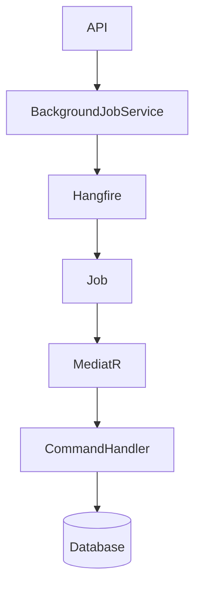
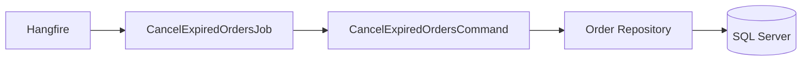
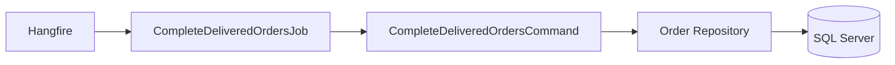
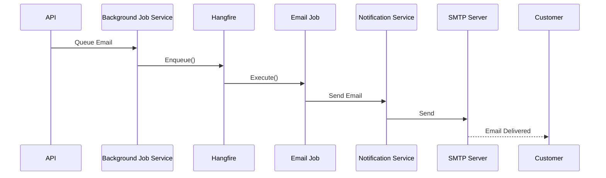
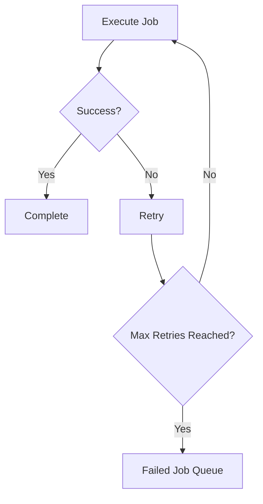
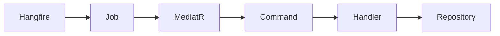
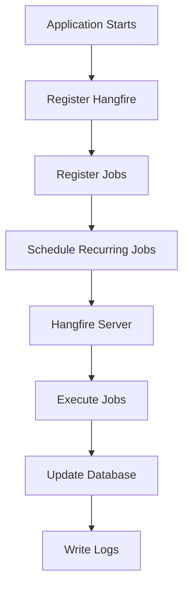

# Background Jobs

The Background Jobs module is responsible for executing asynchronous and scheduled tasks that should not block API requests. ShopSphere uses **Hangfire** to process recurring and fire-and-forget jobs such as order management, email notifications, and future maintenance tasks.

---

## Table of Contents

- [Features](#features)
- [Architecture Overview](#architecture-overview)
- [Background Job Types](#background-job-types)
- [Current Jobs](#current-jobs)
- [Email Jobs](#email-jobs)
- [Email Workflow](#email-workflow)
- [Hangfire Dashboard](#hangfire-dashboard)
- [Dependency Injection](#dependency-injection)
- [Logging](#logging)
- [Error Handling](#error-handling)
- [Job Registration](#job-registration)
- [MediatR Integration](#mediatr-integration)
- [Benefits](#benefits)
- [Current Workflow](#current-workflow)
- [Current Capabilities](#current-capabilities)
- [Planned Enhancements](#planned-enhancements)
- [Technologies](#technologies)

---

## Features

| Feature | Status |
|---|:---:|
| Hangfire Integration | ✅ |
| Recurring Jobs | ✅ |
| Fire-and-Forget Jobs | ✅ |
| Email Processing | ✅ |
| Order Automation | ✅ |
| Automatic Retry | ✅ |
| Dashboard Monitoring | ✅ |
| Structured Logging | ✅ |
| Dependency Injection Support | ✅ |

---

## Architecture Overview



---

## Background Job Types

| Type | Purpose |
|---|---|
| **Fire-and-Forget** | Execute once immediately after being queued |
| **Recurring** | Scheduled execution on a defined interval |
| **Delayed** | Execute after a specified delay |
| **Continuation** | Execute after another job completes |
| **Batch** _(Future)_ | Execute multiple jobs together as a group |

---

## Current Jobs

### CancelExpiredOrdersJob

Automatically cancels unpaid orders after the expiration period.

**Schedule:** Every Minute



---

### CompleteDeliveredOrdersJob

Marks delivered orders as completed after the configured delivery period.

**Schedule:** Daily



---

## Email Jobs

The application queues all emails as background jobs instead of sending them during API requests, ensuring fast response times and reliable delivery.

| Email Job | Trigger |
|---|---|
| **Welcome Email** | Successful email verification |
| **Email Verification** | New user registration |
| **Password Reset** | Forgot password request |
| **Order Confirmation** | Successful order placement |
| **Payment Confirmation** | Successful payment |
| **Shipment Notification** | Order shipped |
| **Delivery Notification** | Order delivered |

---

## Email Workflow



---

## Hangfire Dashboard

The Hangfire Dashboard provides real-time monitoring for all background jobs.

| Section | Description |
|---|---|
| **Scheduled Jobs** | Jobs queued for future execution |
| **Running Jobs** | Jobs currently being processed |
| **Failed Jobs** | Jobs that encountered errors |
| **Processing Jobs** | Jobs in active execution |
| **Retry Attempts** | Jobs being retried after failure |
| **Job History** | Complete log of all executed jobs |

**Default Dashboard Endpoint:**

```
/hangfire
```

---

## Dependency Injection

All jobs are registered through the built-in dependency injection container.

| Job | Type |
|---|---|
| `CancelExpiredOrdersJob` | Recurring |
| `CompleteDeliveredOrdersJob` | Recurring |
| `EmailJob` | Fire-and-Forget |

---

## Logging

Every background job records structured logs using **Serilog**.

| Log Event | Description |
|---|---|
| `Job Started` | Job execution has begun |
| `Orders Cancelled` | Expired orders were cancelled |
| `Orders Completed` | Delivered orders were completed |
| `Email Sent` | Email was delivered successfully |
| `Job Failed` | Job encountered an error |

---

## Error Handling

Background jobs automatically support fault tolerance through Hangfire's built-in retry mechanism.



| Feature | Description |
|---|---|
| **Automatic Retry** | Failed jobs are retried automatically |
| **Exception Logging** | All exceptions are captured via Serilog |
| **Failure History** | Complete failure history stored in Hangfire |
| **Dashboard Diagnostics** | Visual failure inspection via Hangfire Dashboard |

---

## Job Registration

Recurring jobs are registered automatically during application startup.

| Job | Schedule | Cron |
|---|---|---|
| `CancelExpiredOrdersJob` | Every Minute | `* * * * *` |
| `CompleteDeliveredOrdersJob` | Daily | `0 0 * * *` |

---

## MediatR Integration

Background jobs contain **no business logic**. They act purely as lightweight triggers that dispatch MediatR commands to the appropriate handlers.



---

## Benefits

| Benefit | Description |
|---|---|
| **Reusable Business Logic** | Handlers can be called from anywhere |
| **Lightweight Jobs** | Jobs only dispatch commands |
| **Simple Testing** | Handlers can be unit tested independently |
| **Clean Separation** | Clear boundary between scheduling and logic |

---

## Current Workflow



---

## Current Capabilities

| Capability | Status |
|---|:---:|
| Hangfire Integration | ✅ |
| Recurring Jobs | ✅ |
| Email Queueing | ✅ |
| Order Automation | ✅ |
| Structured Logging | ✅ |
| Retry Support | ✅ |
| Dashboard Monitoring | ✅ |
| Dependency Injection | ✅ |

---

## Planned Enhancements

| Feature | Status |
|---|:---:|
| Inventory Synchronization | 📅 Planned |
| Low Stock Notifications | 📅 Planned |
| Payment Reconciliation | 📅 Planned |
| Invoice Generation | 📅 Planned |
| Sales Report Generation | 📅 Planned |
| Cleanup Jobs | 📅 Planned |
| Audit Log Archiving | 📅 Planned |
| Product Recommendation Cache | 📅 Planned |
| Search Index Rebuild | 📅 Planned |
| Scheduled Database Backups | 📅 Planned |
| Customer Reminder Emails | 📅 Planned |
| Analytics Aggregation | 📅 Planned |

---

## Technologies

| Category | Technology |
|---|---|
| **Background Jobs** | Hangfire |
| **Framework** | ASP.NET Core 8 |
| **Mediator** | MediatR |
| **ORM** | Entity Framework Core |
| **Database** | SQL Server |
| **Logging** | Serilog |
| **Architecture** | Clean Architecture |
| **DI Container** | .NET Dependency Injection |

---

<p align="center">
  <sub>Built with precision · Engineered for scale · Designed for clarity</sub>
</p>
