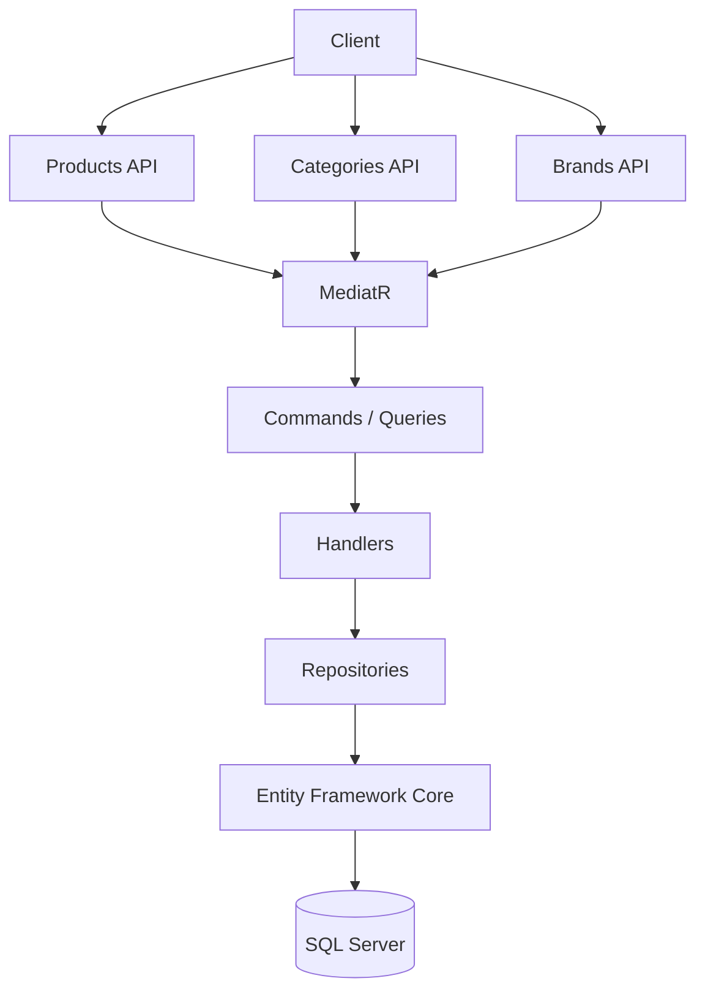
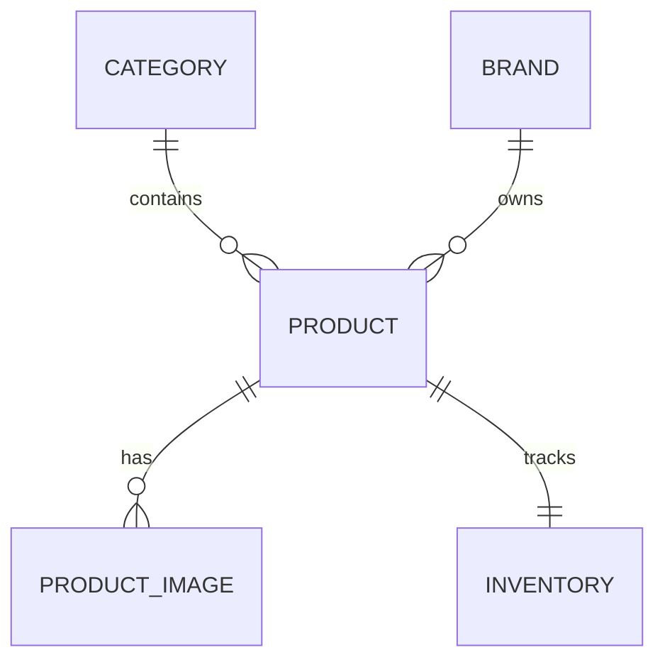
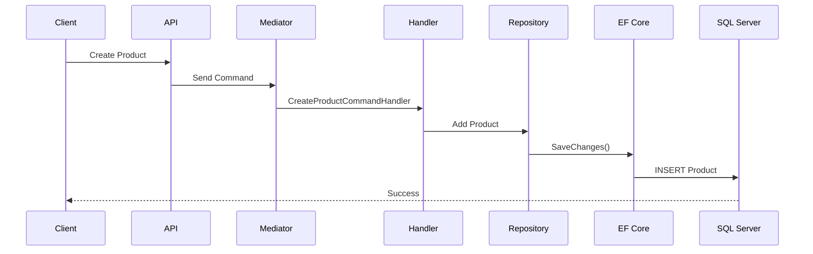

# Catalog

The Catalog module is responsible for managing the products available in ShopSphere. It provides APIs for managing categories, brands, products, images, pricing, and inventory visibility.

---

# Features

- Category Management
- Brand Management
- Product Management
- Product Images
- Inventory Integration
- Soft Validation
- Pagination Support
- Filtering & Search Ready
- Clean Architecture
- CQRS with MediatR

---

# Module Overview



---

# Catalog Structure

```text
Catalog
│
├── Categories
├── Brands
├── Products
├── Product Images
└── Inventory
```

---

# Category

Categories organize products into logical groups.

Example:

- Electronics
- Fashion
- Furniture
- Books

## Entity

| Property | Description |
|----------|-------------|
| Id | Unique identifier |
| Name | Category name |
| Description | Optional description |
| IsActive | Active status |
| CreatedOn | Audit field |
| ModifiedOn | Audit field |

---

# Brand

Brands represent manufacturers or product owners.

Example:

- Apple
- Samsung
- Nike
- Sony

## Entity

| Property | Description |
|----------|-------------|
| Id | Unique identifier |
| Name | Brand name |
| Description | Optional description |
| IsActive | Active status |

---

# Product

Products are the primary catalog items.

Each product belongs to:

- One Category
- One Brand

Each product can have:

- Multiple Images
- One Inventory Record

---

## Product Entity

| Property | Description |
|----------|-------------|
| Id | Product Id |
| Name | Product name |
| Description | Product description |
| SKU | Stock Keeping Unit |
| Price | Selling price |
| CategoryId | Category reference |
| BrandId | Brand reference |
| IsActive | Availability |
| CreatedOn | Audit field |
| ModifiedOn | Audit field |

---

# Product Images

Each product supports multiple images.

## Entity

| Property | Description |
|----------|-------------|
| Id | Image Id |
| ProductId | Product reference |
| ImageUrl | Image location |
| DisplayOrder | Sort order |
| IsPrimary | Primary image |

---

# Inventory Relationship

Every product has exactly one inventory record.



---

# CQRS Implementation

The Catalog module follows the CQRS pattern.

## Commands

- CreateCategoryCommand
- UpdateCategoryCommand
- DeleteCategoryCommand

- CreateBrandCommand
- UpdateBrandCommand
- DeleteBrandCommand

- CreateProductCommand
- UpdateProductCommand
- DeleteProductCommand

---

## Queries

- GetCategoriesQuery
- GetCategoryByIdQuery

- GetBrandsQuery
- GetBrandByIdQuery

- GetProductsQuery
- GetProductByIdQuery

---

# Request Flow



---

# Validation

The Catalog module validates:

- Required fields
- Duplicate names
- Existing Category
- Existing Brand
- Positive product price
- SKU uniqueness

Validation is implemented using **FluentValidation**.

---

# Relationships

```text
Category
    │
    ├──── Products
                 │
                 ├──── Images
                 │
                 └──── Inventory

Brand
    │
    └──── Products
```

---

# Current API Endpoints

## Categories

| Method | Endpoint |
|---------|----------|
| POST | /api/categories |
| GET | /api/categories |
| GET | /api/categories/{id} |
| PUT | /api/categories/{id} |
| DELETE | /api/categories/{id} |

---

## Brands

| Method | Endpoint |
|---------|----------|
| POST | /api/brands |
| GET | /api/brands |
| GET | /api/brands/{id} |
| PUT | /api/brands/{id} |
| DELETE | /api/brands/{id} |

---

## Products

| Method | Endpoint |
|---------|----------|
| POST | /api/products |
| GET | /api/products |
| GET | /api/products/{id} |
| PUT | /api/products/{id} |
| DELETE | /api/products/{id} |

---

# Future Enhancements

Planned improvements include:

- Product Search
- Advanced Filtering
- Product Reviews
- Product Ratings
- Wishlist Integration
- Product Recommendations
- ElasticSearch Integration
- Full-text Search
- Product Variants
- Product Attributes
- Product Specifications
- Bulk Import/Export
- Image Upload to Cloud Storage

---

# Technologies

- ASP.NET Core 8
- Entity Framework Core
- SQL Server
- MediatR
- FluentValidation
- Clean Architecture
- Repository Pattern
- CQRS