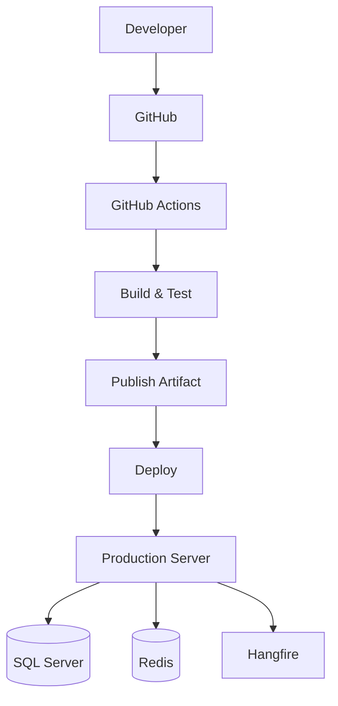
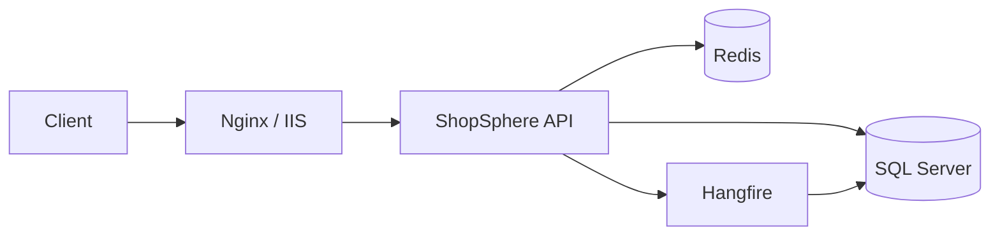
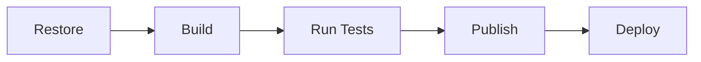
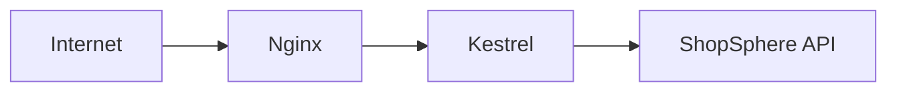
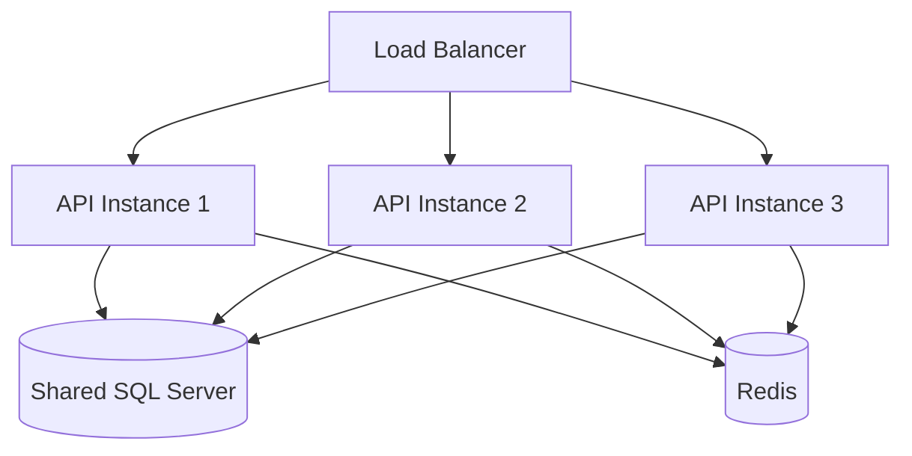
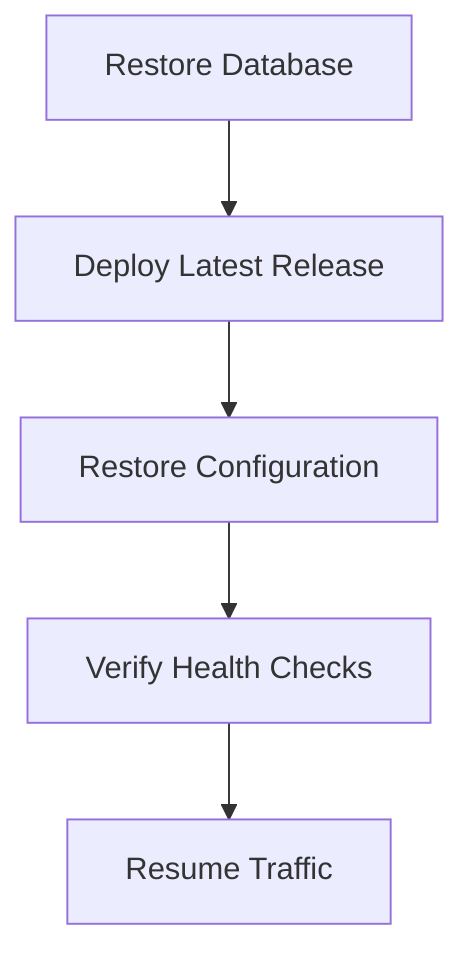

# Deployment

ShopSphere is designed for cloud-native deployment using modern DevOps practices. The application can be deployed locally, on a Virtual Machine, Azure App Service, Docker containers, or Kubernetes with minimal configuration changes.

---

## Table of Contents

- [Deployment Architecture](#deployment-architecture)
- [Production Architecture](#production-architecture)
- [Deployment Options](#deployment-options)
- [Environment Configuration](#environment-configuration)
- [Required Configuration](#required-configuration)
- [Deployment Pipeline](#deployment-pipeline)
- [GitHub Actions](#github-actions)
- [Publish](#publish)
- [Database Migration](#database-migration)
- [Hangfire](#hangfire)
- [Health Checks](#health-checks)
- [Logging](#logging)
- [HTTPS](#https)
- [Reverse Proxy](#reverse-proxy)
- [Scaling](#scaling)
- [Deployment Checklist](#deployment-checklist)
- [Production Checklist](#production-checklist)
- [Monitoring](#monitoring)
- [Backup Strategy](#backup-strategy)
- [Disaster Recovery](#disaster-recovery)
- [Future Improvements](#future-improvements)
- [Technologies](#technologies)

---

## Deployment Architecture



---

## Production Architecture



---

## Deployment Options

| Target | Status |
|---|:---:|
| IIS | ✅ Supported |
| Linux VM | ✅ Supported |
| Windows Server | ✅ Supported |
| Docker | 📅 Planned |
| Azure App Service | 📅 Planned |
| Azure Container Apps | 📅 Planned |
| Azure Kubernetes Service (AKS) | 📅 Planned |

---

## Environment Configuration

Configuration is managed through **appsettings** files and environment variables.

| File | Purpose |
|---|---|
| `appsettings.json` | Base configuration shared across all environments |
| `appsettings.Development.json` | Local development overrides |
| `appsettings.Production.json` | Production environment values |

---

## Required Configuration

### Database

```json
{
  "ConnectionStrings": {
    "DefaultConnection": "Your_SQL_Server_Connection_String"
  }
}
```

### Redis

```json
{
  "ConnectionStrings": {
    "Redis": "Your_Redis_Connection_String"
  }
}
```

### JWT

```json
{
  "Jwt": {
    "Issuer": "your-issuer",
    "Audience": "your-audience",
    "SecretKey": "your-secret-key-minimum-32-characters"
  }
}
```

### Email

```json
{
  "EmailSettings": {
    "Host": "smtp.your-provider.com",
    "Port": "587",
    "Username": "your-email@domain.com",
    "Password": "your-email-password"
  }
}
```

---

## Deployment Pipeline



---

## GitHub Actions

The current CI/CD pipeline automatically performs:

| Step | Description |
|---|---|
| **Restore** | Restores all NuGet packages |
| **Build** | Compiles the entire solution |
| **Unit Tests** | Runs all unit tests |
| **Integration Tests** | Runs all integration tests |
| **Code Coverage** | Generates test coverage report |
| **Upload Artifacts** | Stores build artifacts |

---

## Publish

Generate deployment-ready files:

```bash
dotnet publish src/ShopSphere.Api \
  -c Release \
  -o publish
```

Output structure:

```text
publish/
├── ShopSphere.Api.dll
├── appsettings.json
├── wwwroot/
└── Dependencies
```

---

## Database Migration

Run migrations before starting the application:

```bash
dotnet ef database update
```

Or apply migrations automatically during application startup:

```csharp
dbContext.Database.Migrate();
```

---

## Hangfire

Hangfire initializes automatically on startup:

| Action | Description |
|---|---|
| **Schema Creation** | Creates required Hangfire database tables |
| **Processing Server** | Starts the background job processing server |
| **Recurring Jobs** | Registers all scheduled recurring jobs |

**Dashboard Endpoint:**

```
/hangfire
```

---

## Health Checks

Available health monitoring endpoints:

| Endpoint | Description |
|---|---|
| `/health` | Overall application health status |
| `/health/live` | Liveness probe |
| `/health/ready` | Readiness probe |
| `/health-ui` | Visual health check dashboard |

---

## Logging

Production logging is powered by **Serilog**.

| Output | Status |
|---|:---:|
| Console | ✅ Active |
| File | ✅ Active |
| Structured JSON | ✅ Active |
| Seq | 📅 Planned |
| Azure Monitor | 📅 Planned |

---

## HTTPS

Production deployments must always enforce:

- ✅ HTTPS enabled
- ✅ HSTS headers
- ✅ TLS 1.2 or higher

---

## Reverse Proxy

Recommended production setup using Nginx in front of Kestrel:



---

## Scaling

ShopSphere supports horizontal scaling through shared infrastructure:



---

## Deployment Checklist

### Pre-Release

| Check | Description |
|---|---|
| ✅ Build Succeeds | Solution compiles without errors |
| ✅ Tests Pass | All unit and integration tests pass |
| ✅ Migration Generated | Latest EF Core migration is applied |
| ✅ Secrets Configured | All sensitive values are set |
| ✅ Connection Strings | Database and Redis strings verified |
| ✅ JWT Configured | Issuer, Audience, and SecretKey set |
| ✅ Email Configured | SMTP settings verified |
| ✅ Redis Available | Cache connection confirmed |
| ✅ Hangfire Running | Background job server active |

---

## Production Checklist

| Item | Status |
|---|:---:|
| HTTPS Enabled | ✅ |
| SQL Server Available | ✅ |
| Redis Running | ✅ |
| Hangfire Running | ✅ |
| Health Checks Enabled | ✅ |
| Serilog Configured | ✅ |
| Database Migrated | ✅ |

---

## Monitoring

| Area | Tool / Method |
|---|---|
| **Application Logs** | Serilog structured logs |
| **SQL Performance** | SQL Server query monitoring |
| **Redis Health** | Redis health check endpoint |
| **Background Jobs** | Hangfire Dashboard |
| **API Health** | Health check endpoints |
| **Application Metrics** | Prometheus _(Planned)_ |

---

## Backup Strategy

| Backup Type | Frequency |
|---|---|
| **Full Database Backup** | Weekly |
| **Differential Backup** | Daily |
| **Transaction Log Backup** | Hourly |
| **Configuration Backup** | On every change |
| **Artifact Backup** | On every release |

---

## Disaster Recovery



---

## Future Improvements

| Feature | Status |
|---|:---:|
| Docker Support | 📅 Planned |
| Docker Compose | 📅 Planned |
| Kubernetes Manifests | 📅 Planned |
| Helm Charts | 📅 Planned |
| Azure DevOps Pipeline | 📅 Planned |
| Terraform Infrastructure | 📅 Planned |
| Blue-Green Deployment | 📅 Planned |
| Canary Releases | 📅 Planned |
| Automatic Rollback | 📅 Planned |
| Azure Key Vault Secrets | 📅 Planned |
| Prometheus Metrics | 📅 Planned |
| Grafana Dashboards | 📅 Planned |

---

## Technologies

| Category | Technology |
|---|---|
| **Framework** | ASP.NET Core 8 |
| **Database** | SQL Server |
| **Cache** | Redis |
| **Background Jobs** | Hangfire |
| **CI/CD** | GitHub Actions |
| **Logging** | Serilog |
| **Health Checks** | ASP.NET Core Health Checks |
| **Web Server** | IIS / Nginx |
| **Containerization** | Docker _(Planned)_ |
| **Orchestration** | Kubernetes _(Planned)_ |

---

<p align="center">
  <sub>Built with precision · Engineered for scale · Designed for clarity</sub>
</p>
