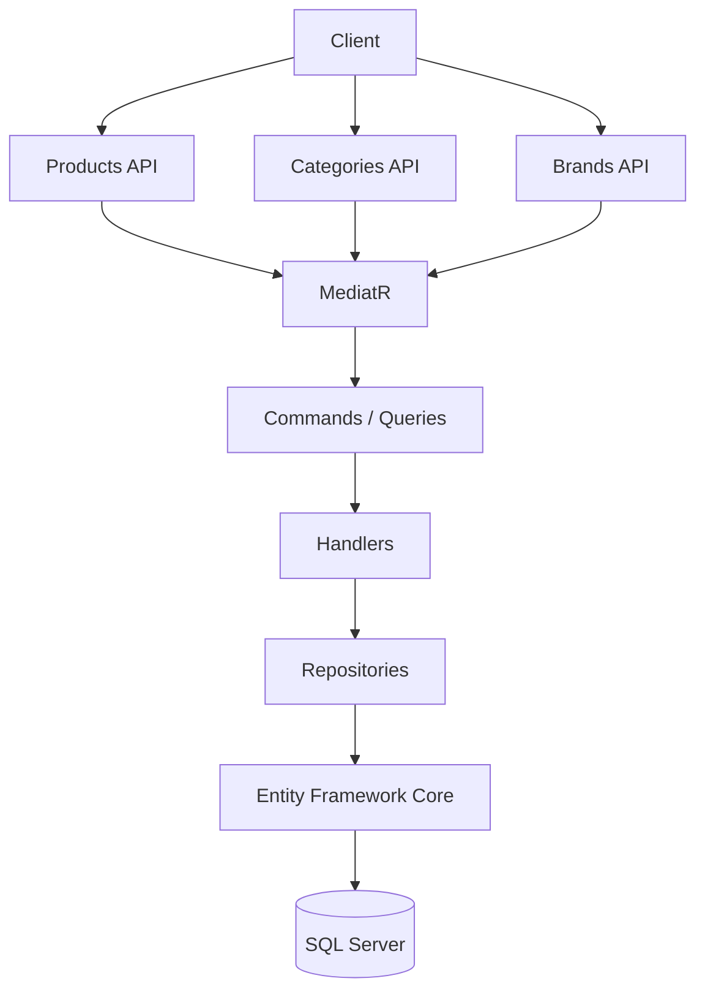
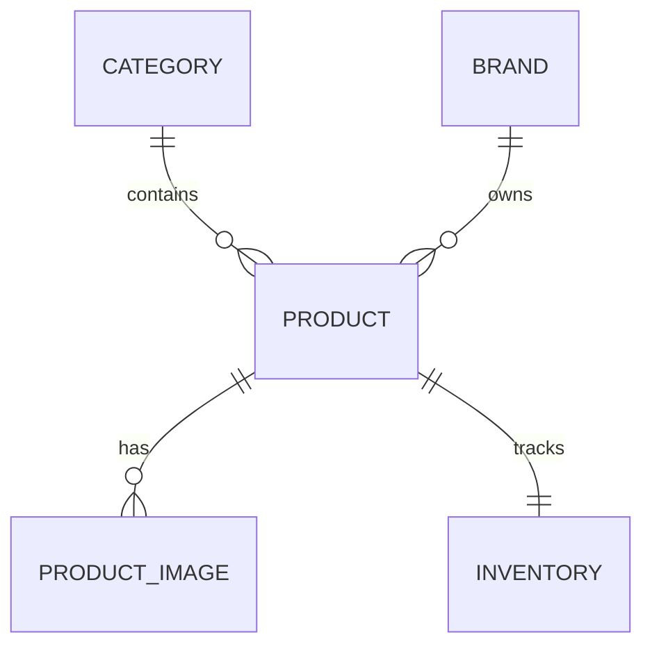
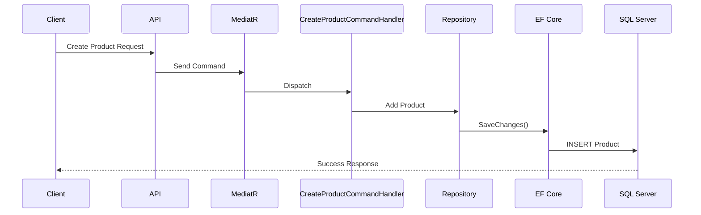
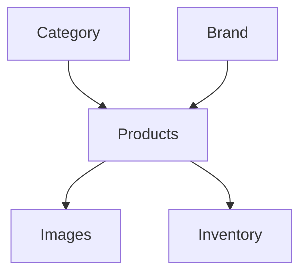

# Catalog

The Catalog module is responsible for managing the products available in ShopSphere. It provides APIs for managing categories, brands, products, images, pricing, and inventory visibility.

---

## Table of Contents

- [Features](#features)
- [Module Overview](#module-overview)
- [Catalog Structure](#catalog-structure)
- [Category](#category)
- [Brand](#brand)
- [Product](#product)
- [Product Images](#product-images)
- [Inventory Relationship](#inventory-relationship)
- [CQRS Implementation](#cqrs-implementation)
- [Request Flow](#request-flow)
- [Validation](#validation)
- [Relationships](#relationships)
- [Current API Endpoints](#current-api-endpoints)
- [Future Enhancements](#future-enhancements)
- [Technologies](#technologies)

---

## Features

| Feature | Status |
|---|:---:|
| Category Management | ✅ |
| Brand Management | ✅ |
| Product Management | ✅ |
| Product Images | ✅ |
| Inventory Integration | ✅ |
| Soft Validation | ✅ |
| Pagination Support | ✅ |
| Filtering & Search Ready | ✅ |
| Clean Architecture | ✅ |
| CQRS with MediatR | ✅ |

---

## Module Overview



---

## Catalog Structure

```text
Catalog/
│
├── Categories
├── Brands
├── Products
├── Product Images
└── Inventory
```

---

## Category

Categories organize products into logical groups.

**Examples:** Electronics · Fashion · Furniture · Books

### Category Entity

| Property | Description |
|---|---|
| **Id** | Unique identifier |
| **Name** | Category name |
| **Description** | Optional description |
| **IsActive** | Active status |
| **CreatedOn** | Audit field |
| **ModifiedOn** | Audit field |

---

## Brand

Brands represent manufacturers or product owners.

**Examples:** Apple · Samsung · Nike · Sony

### Brand Entity

| Property | Description |
|---|---|
| **Id** | Unique identifier |
| **Name** | Brand name |
| **Description** | Optional description |
| **IsActive** | Active status |

---

## Product

Products are the primary catalog items.

Each product belongs to:
- One **Category**
- One **Brand**

Each product can have:
- Multiple **Images**
- One **Inventory Record**

### Product Entity

| Property | Description |
|---|---|
| **Id** | Product identifier |
| **Name** | Product name |
| **Description** | Product description |
| **SKU** | Stock Keeping Unit |
| **Price** | Selling price |
| **CategoryId** | Category reference |
| **BrandId** | Brand reference |
| **IsActive** | Availability status |
| **CreatedOn** | Audit field |
| **ModifiedOn** | Audit field |

---

## Product Images

Each product supports multiple images.

### Product Image Entity

| Property | Description |
|---|---|
| **Id** | Image identifier |
| **ProductId** | Product reference |
| **ImageUrl** | Image location URL |
| **DisplayOrder** | Sort order for display |
| **IsPrimary** | Marks the primary image |

---

## Inventory Relationship

Every product has exactly one inventory record.



---

## CQRS Implementation

The Catalog module follows the CQRS pattern using MediatR.

### Commands

| Command | Description |
|---|---|
| `CreateCategoryCommand` | Creates a new category |
| `UpdateCategoryCommand` | Updates an existing category |
| `DeleteCategoryCommand` | Removes a category |
| `CreateBrandCommand` | Creates a new brand |
| `UpdateBrandCommand` | Updates an existing brand |
| `DeleteBrandCommand` | Removes a brand |
| `CreateProductCommand` | Creates a new product |
| `UpdateProductCommand` | Updates an existing product |
| `DeleteProductCommand` | Removes a product |

### Queries

| Query | Description |
|---|---|
| `GetCategoriesQuery` | Retrieves all categories |
| `GetCategoryByIdQuery` | Retrieves a category by ID |
| `GetBrandsQuery` | Retrieves all brands |
| `GetBrandByIdQuery` | Retrieves a brand by ID |
| `GetProductsQuery` | Retrieves all products |
| `GetProductByIdQuery` | Retrieves a product by ID |

---

## Request Flow



---

## Validation

The Catalog module validates all incoming requests using **FluentValidation**.

| Validation Rule | Description |
|---|---|
| **Required Fields** | Name and key fields must be present |
| **Duplicate Names** | Category and brand names must be unique |
| **Existing Category** | Product must reference a valid category |
| **Existing Brand** | Product must reference a valid brand |
| **Positive Price** | Product price must be greater than zero |
| **SKU Uniqueness** | Each product must have a unique SKU |

---

## Relationships



---

## Current API Endpoints

### Categories

| Method | Endpoint | Description |
|:---:|---|---|
| `POST` | `/api/categories` | Create a new category |
| `GET` | `/api/categories` | Retrieve all categories |
| `GET` | `/api/categories/{id}` | Retrieve category by ID |
| `PUT` | `/api/categories/{id}` | Update a category |
| `DELETE` | `/api/categories/{id}` | Delete a category |

### Brands

| Method | Endpoint | Description |
|:---:|---|---|
| `POST` | `/api/brands` | Create a new brand |
| `GET` | `/api/brands` | Retrieve all brands |
| `GET` | `/api/brands/{id}` | Retrieve brand by ID |
| `PUT` | `/api/brands/{id}` | Update a brand |
| `DELETE` | `/api/brands/{id}` | Delete a brand |

### Products

| Method | Endpoint | Description |
|:---:|---|---|
| `POST` | `/api/products` | Create a new product |
| `GET` | `/api/products` | Retrieve all products |
| `GET` | `/api/products/{id}` | Retrieve product by ID |
| `PUT` | `/api/products/{id}` | Update a product |
| `DELETE` | `/api/products/{id}` | Delete a product |

---

## Future Enhancements

| Feature | Status |
|---|:---:|
| Product Search | 📅 Planned |
| Advanced Filtering | 📅 Planned |
| Product Reviews | 📅 Planned |
| Product Ratings | 📅 Planned |
| Wishlist Integration | 📅 Planned |
| Product Recommendations | 📅 Planned |
| ElasticSearch Integration | 📅 Planned |
| Full-text Search | 📅 Planned |
| Product Variants | 📅 Planned |
| Product Attributes | 📅 Planned |
| Product Specifications | 📅 Planned |
| Bulk Import / Export | 📅 Planned |
| Cloud Image Storage | 📅 Planned |

---

## Technologies

| Category | Technology |
|---|---|
| **Framework** | ASP.NET Core 8 |
| **ORM** | Entity Framework Core |
| **Database** | SQL Server |
| **Mediator** | MediatR |
| **Validation** | FluentValidation |
| **Architecture** | Clean Architecture |
| **Pattern** | Repository Pattern · CQRS |

---

<p align="center">
  <sub>Built with precision · Engineered for scale · Designed for clarity</sub>
</p>
