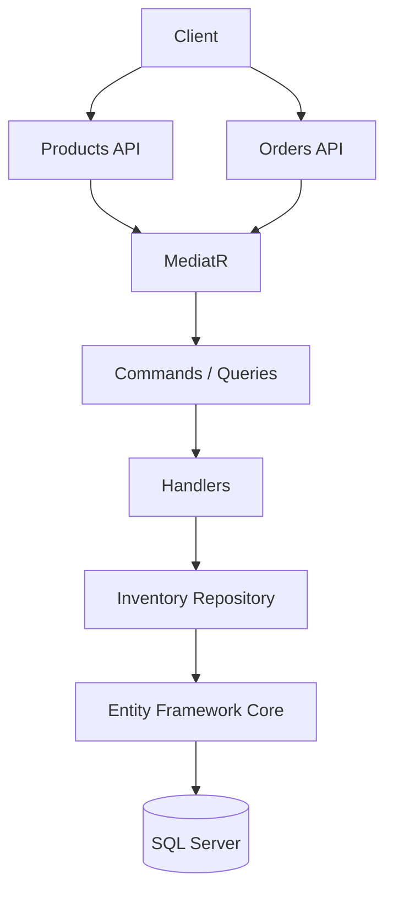
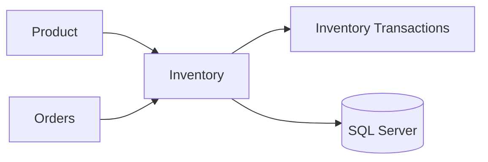
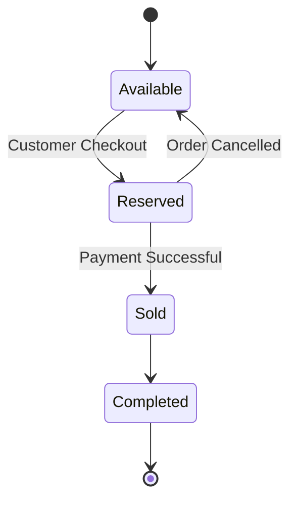
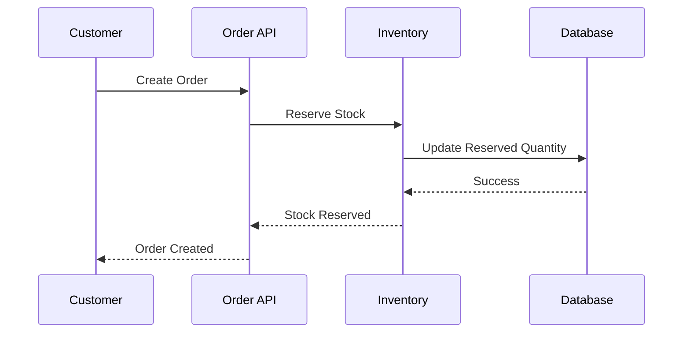
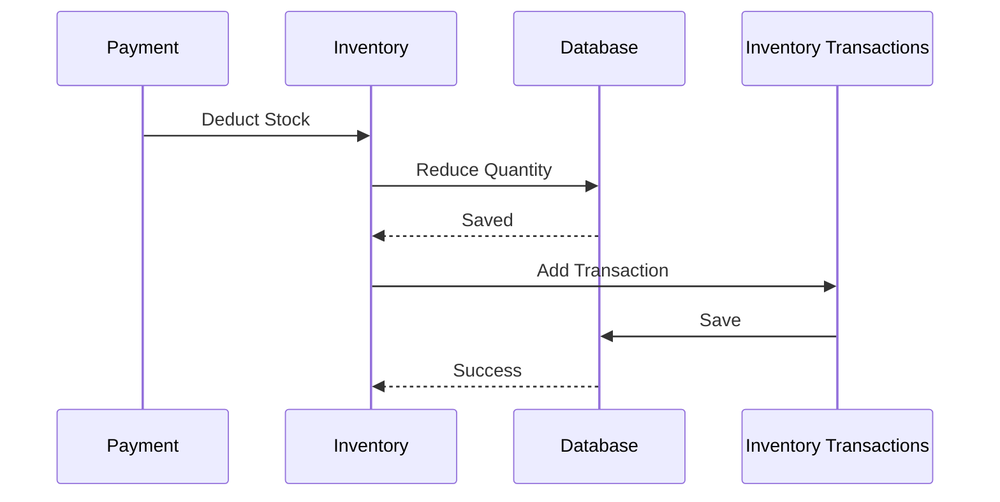
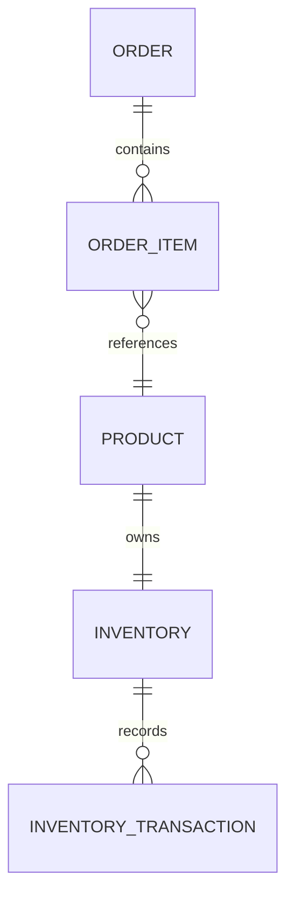
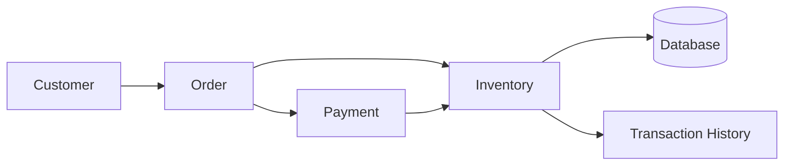
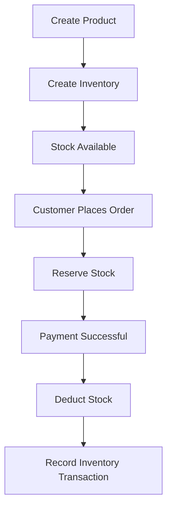

# Inventory

The Inventory module is responsible for managing product stock levels, tracking inventory movements, and ensuring products are available for purchase. It integrates closely with the Catalog and Orders modules to provide accurate stock validation and reservation.

---

## Table of Contents

- [Features](#features)
- [Module Overview](#module-overview)
- [Inventory Architecture](#inventory-architecture)
- [Inventory Entity](#inventory-entity)
- [Inventory Transactions](#inventory-transactions)
- [Inventory Lifecycle](#inventory-lifecycle)
- [Stock Reservation Flow](#stock-reservation-flow)
- [Order Completion Flow](#order-completion-flow)
- [Reservation Logic](#reservation-logic)
- [Inventory Validation](#inventory-validation)
- [CQRS Commands](#cqrs-commands)
- [Queries](#queries)
- [Entity Relationships](#entity-relationships)
- [Repository Layer](#repository-layer)
- [Inventory Rules](#inventory-rules)
- [Error Scenarios](#error-scenarios)
- [Integration with Orders](#integration-with-orders)
- [Inventory Workflow](#inventory-workflow)
- [Current Capabilities](#current-capabilities)
- [Planned Enhancements](#planned-enhancements)
- [Technologies](#technologies)

---

## Features

- Stock Management
- Inventory Tracking
- Stock Reservation
- Stock Release
- Inventory Transactions
- Automatic Stock Updates
- Low Stock Detection _(Planned)_
- CQRS Architecture
- Repository Pattern
- Entity Framework Core

---

## Module Overview



---

## Inventory Architecture



---

## Inventory Entity

Each product has a single inventory record.

| Property | Description |
|---|---|
| **Id** | Inventory identifier |
| **ProductId** | Associated product |
| **Quantity** | Available stock |
| **ReservedQuantity** | Reserved stock |
| **CreatedOn** | Audit field |
| **ModifiedOn** | Audit field |

---

## Inventory Transactions

Every inventory change is recorded.

Supported transaction types:

| Type | Description |
|---|---|
| **Stock In** | New stock added to inventory |
| **Stock Out** | Stock removed from inventory |
| **Reservation** | Stock reserved for an order |
| **Reservation Release** | Reserved stock returned to available |
| **Order Completed** | Stock deducted after successful payment |
| **Order Cancelled** | Reserved stock released back |
| **Manual Adjustment** | Admin-initiated stock correction |

---

## Inventory Transaction Entity

| Property | Description |
|---|---|
| **Id** | Transaction identifier |
| **InventoryId** | Inventory reference |
| **Quantity** | Quantity changed |
| **Type** | Transaction type |
| **Reason** | Description |
| **CreatedOn** | Audit timestamp |

---

## Inventory Lifecycle



---

## Stock Reservation Flow



---

## Order Completion Flow



---

## Reservation Logic

Available stock is calculated as:

```
Available = Quantity - ReservedQuantity
```

| Quantity | Reserved | Available |
|:---:|:---:|:---:|
| 100 | 20 | 80 |
| 50 | 10 | 40 |
| 15 | 15 | 0 |

---

## Inventory Validation

Before creating an order, the system verifies:

- Product exists
- Product is active
- Inventory record exists
- Available quantity is sufficient

If validation fails:

- Order creation is rejected
- Stock remains unchanged

---

## CQRS Commands

Current inventory operations are implemented using MediatR.

| Command | Description |
|---|---|
| `CreateInventoryCommand` | Creates a new inventory record for a product |
| `UpdateInventoryCommand` | Updates existing inventory details |
| `ReserveInventoryCommand` | Reserves stock for a pending order |
| `ReleaseInventoryCommand` | Releases previously reserved stock |
| `DeductInventoryCommand` | Permanently deducts stock after order completion |

---

## Queries

| Query | Description |
|---|---|
| `GetInventoryByProductIdQuery` | Retrieves inventory record by product ID |
| `GetInventoryQuery` | Retrieves a specific inventory record |
| `GetInventoryTransactionsQuery` | Retrieves transaction history for an inventory |

---

## Entity Relationships



---

## Repository Layer

The Inventory module follows the Repository Pattern.

Responsibilities include:

- Retrieve inventory records
- Update stock quantities
- Reserve stock for orders
- Release reserved stock
- Persist inventory transactions

---

## Inventory Rules

Current business rules:

- Stock cannot become negative
- Reserved quantity cannot exceed available quantity
- Every inventory modification creates a transaction record
- Inventory updates occur within a database transaction

---

## Error Scenarios

| Error Code | Description |
|---|---|
| `PRODUCT_NOT_FOUND` | Product does not exist |
| `INVENTORY_NOT_FOUND` | Inventory record is missing |
| `INSUFFICIENT_STOCK` | Not enough inventory available |
| `INVALID_QUANTITY` | Quantity must be greater than zero |

---

## Integration with Orders



---

## Inventory Workflow



---

## Current Capabilities

| Capability | Status |
|---|:---:|
| Inventory per Product | ✅ |
| Stock Tracking | ✅ |
| Inventory Transactions | ✅ |
| Stock Reservation | ✅ |
| Stock Deduction | ✅ |
| Order Integration | ✅ |
| Entity Framework Persistence | ✅ |
| CQRS | ✅ |
| Repository Pattern | ✅ |

---

## Planned Enhancements

| Feature | Status |
|---|:---:|
| Low Stock Notifications | 📅 Planned |
| Warehouse Management | 📅 Planned |
| Multi-Warehouse Inventory | 📅 Planned |
| Inventory Transfers | 📅 Planned |
| Barcode Support | 📅 Planned |
| Batch / Lot Tracking | 📅 Planned |
| Expiry Date Management | 📅 Planned |
| Supplier Restocking | 📅 Planned |
| Inventory Dashboard | 📅 Planned |
| Inventory Reports | 📅 Planned |
| Automatic Reordering | 📅 Planned |
| Stock Forecasting | 📅 Planned |

---

## Technologies

| Category | Technology |
|---|---|
| **Framework** | ASP.NET Core 8 |
| **ORM** | Entity Framework Core |
| **Database** | SQL Server |
| **Mediator** | MediatR |
| **Architecture** | Clean Architecture |
| **Pattern** | Repository Pattern · CQRS |
| **Validation** | FluentValidation |
| **Logging** | Serilog |

---

<p align="center">
  <sub>Built with precision · Engineered for scale · Designed for clarity</sub>
</p>
