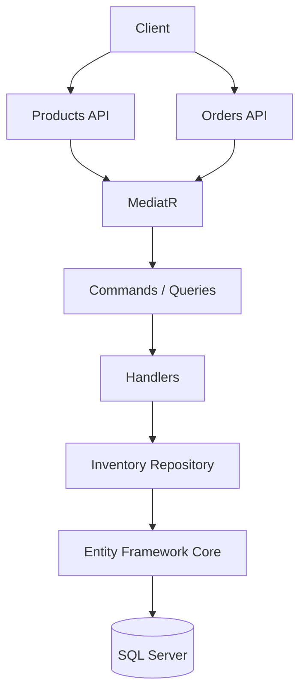
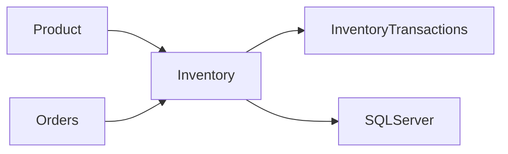
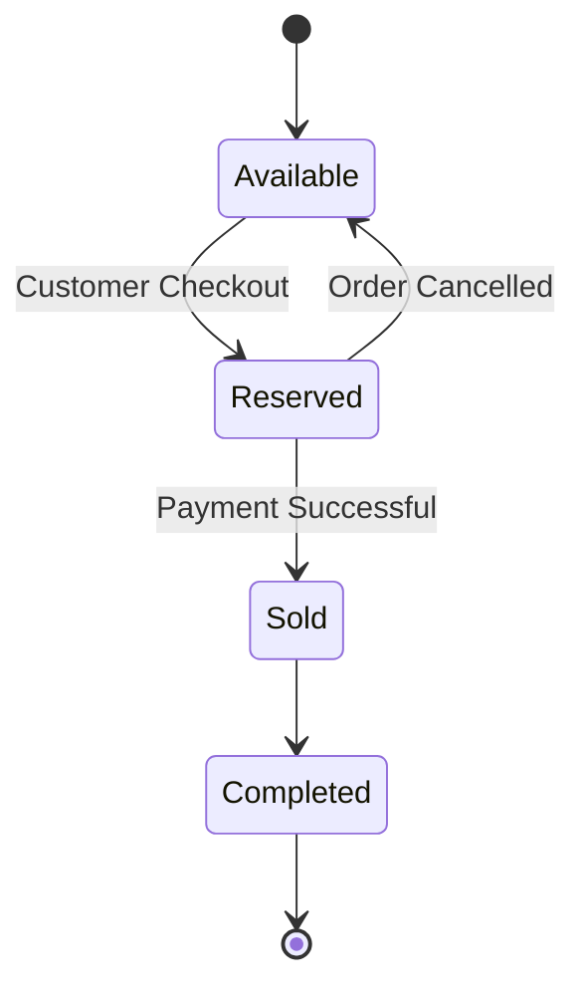
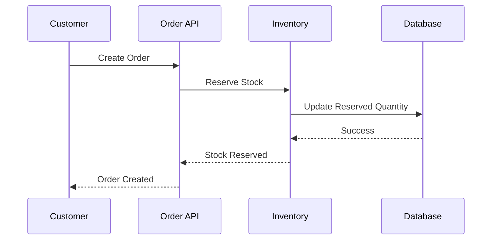
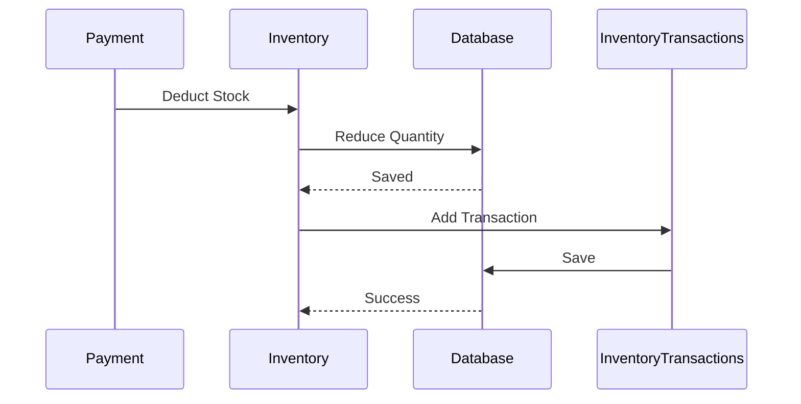
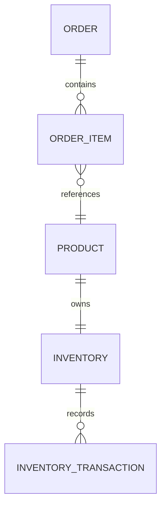
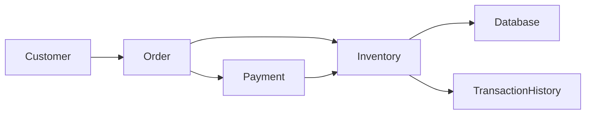

# Inventory

The Inventory module is responsible for managing product stock levels, tracking inventory movements, and ensuring products are available for purchase. It integrates closely with the Catalog and Orders modules to provide accurate stock validation and reservation.

---

# Features

- Stock Management
- Inventory Tracking
- Stock Reservation
- Stock Release
- Inventory Transactions
- Automatic Stock Updates
- Low Stock Detection (Planned)
- CQRS Architecture
- Repository Pattern
- Entity Framework Core

---

# Module Overview



---

# Inventory Architecture



---

# Inventory Entity

Each product has a single inventory record.

| Property | Description |
|----------|-------------|
| Id | Inventory identifier |
| ProductId | Associated product |
| Quantity | Available stock |
| ReservedQuantity | Reserved stock |
| CreatedOn | Audit field |
| ModifiedOn | Audit field |

---

# Inventory Transactions

Every inventory change is recorded.

Supported transaction types:

- Stock In
- Stock Out
- Reservation
- Reservation Release
- Order Completed
- Order Cancelled
- Manual Adjustment

---

## Inventory Transaction Entity

| Property | Description |
|----------|-------------|
| Id | Transaction identifier |
| InventoryId | Inventory reference |
| Quantity | Quantity changed |
| Type | Transaction type |
| Reason | Description |
| CreatedOn | Audit timestamp |

---

# Inventory Lifecycle



---

# Stock Reservation Flow



---

# Order Completion Flow



---

# Reservation Logic

Available Stock is calculated as:

```
Available = Quantity - ReservedQuantity
```

Example:

| Quantity | Reserved | Available |
|----------|-----------|------------|
| 100 | 20 | 80 |
| 50 | 10 | 40 |
| 15 | 15 | 0 |

---

# Inventory Validation

Before creating an order, the system verifies:

- Product exists
- Product is active
- Inventory exists
- Available quantity is sufficient

If validation fails:

- Order creation is rejected
- Stock remains unchanged

---

# CQRS Commands

Current inventory operations are implemented using MediatR.

Examples:

- CreateInventoryCommand
- UpdateInventoryCommand
- ReserveInventoryCommand
- ReleaseInventoryCommand
- DeductInventoryCommand

---

# Queries

Examples:

- GetInventoryByProductIdQuery
- GetInventoryQuery
- GetInventoryTransactionsQuery

---

# Entity Relationships



---

# Repository Layer

The Inventory module follows the Repository Pattern.

Responsibilities include:

- Retrieve inventory
- Update stock
- Reserve stock
- Release stock
- Persist inventory transactions

---

# Inventory Rules

Current business rules include:

- Stock cannot become negative
- Reserved quantity cannot exceed available quantity
- Every inventory modification creates a transaction record
- Inventory updates occur within a database transaction

---

# Error Scenarios

Examples:

| Error | Description |
|--------|-------------|
| PRODUCT_NOT_FOUND | Product does not exist |
| INVENTORY_NOT_FOUND | Inventory record missing |
| INSUFFICIENT_STOCK | Not enough inventory |
| INVALID_QUANTITY | Quantity must be greater than zero |

---

# Integration with Orders



---

# Inventory Workflow

```mermaid
flowchart TD

Create Product

↓

Create Inventory

↓

Stock Available

↓

Customer Places Order

↓

Reserve Stock

↓

Payment Successful

↓

Deduct Stock

↓

Record Inventory Transaction
```

---

# Current Capabilities

✅ Inventory per Product

✅ Stock Tracking

✅ Inventory Transactions

✅ Stock Reservation

✅ Stock Deduction

✅ Order Integration

✅ Entity Framework Persistence

✅ CQRS

✅ Repository Pattern

---

# Planned Enhancements

Future improvements include:

- Low Stock Notifications
- Warehouse Management
- Multi-Warehouse Inventory
- Inventory Transfers
- Barcode Support
- Batch/Lot Tracking
- Expiry Date Management
- Supplier Restocking
- Inventory Dashboard
- Inventory Reports
- Automatic Reordering
- Stock Forecasting

---

# Technologies

- ASP.NET Core 8
- Entity Framework Core
- SQL Server
- MediatR
- Clean Architecture
- Repository Pattern
- CQRS
- FluentValidation
- Serilog