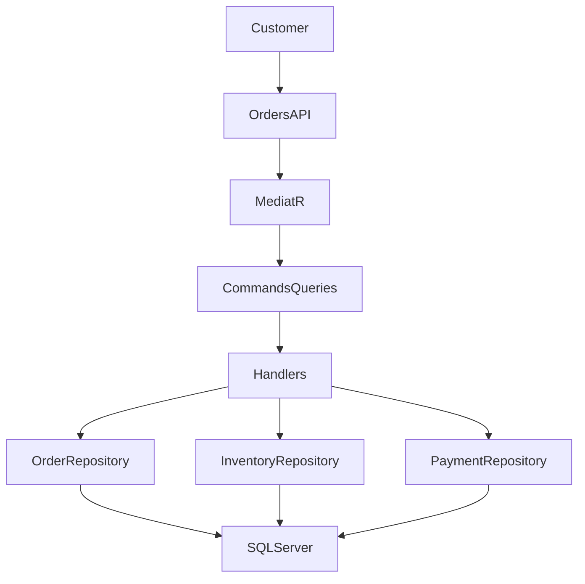
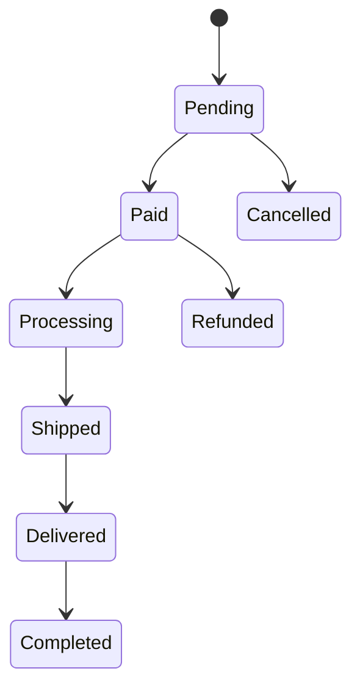
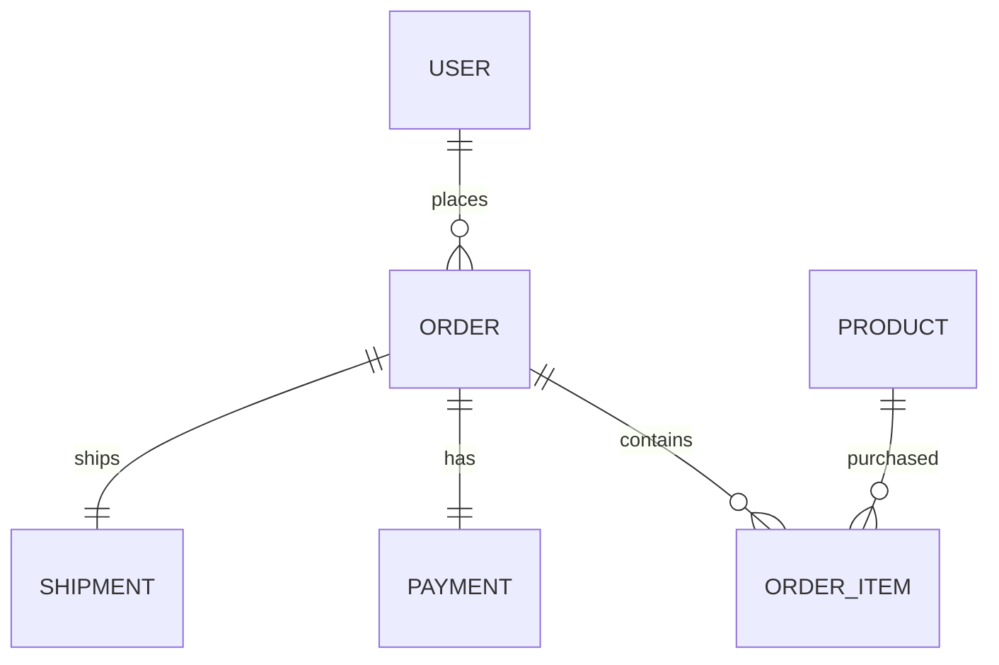
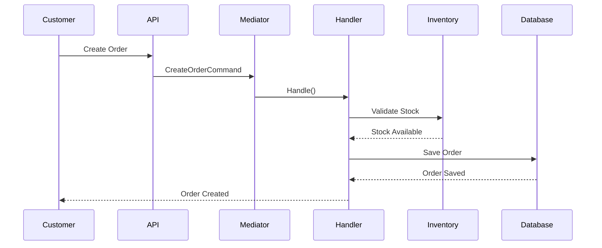

# Orders

The Orders module manages the complete order lifecycle—from order creation through payment, shipment, delivery, and completion. It coordinates with the Catalog, Inventory, Payment, and Notification modules to ensure a consistent and reliable purchasing experience.

---

# Features

- Order Creation
- Multiple Order Items
- Order Status Tracking
- Inventory Reservation
- Payment Integration
- Shipment Tracking
- Order Completion
- Order Cancellation
- Background Job Support
- CQRS Architecture

---

# Module Overview



---

# Order Lifecycle



---

# Order Entity

| Property | Description |
|----------|-------------|
| Id | Order Id |
| OrderNumber | Unique order number |
| UserId | Customer |
| Status | Current status |
| SubTotal | Total before discounts |
| Discount | Applied discount |
| Total | Final payable amount |
| CreatedOn | Created date |
| ModifiedOn | Updated date |

---

# Order Item Entity

Each order contains one or more order items.

| Property | Description |
|----------|-------------|
| Id | Order Item Id |
| OrderId | Parent Order |
| ProductId | Purchased product |
| ProductName | Snapshot name |
| Quantity | Purchased quantity |
| UnitPrice | Price at purchase |
| Total | Quantity × Price |

---

# Entity Relationship



---

# Order Creation Flow



---

# Payment Flow

```mermaid
flowchart LR

Pending

↓

Payment Successful

↓

Paid

↓

Inventory Deducted

↓

Shipment Created
```

---

# Shipment Flow

```mermaid
flowchart LR

Paid

↓

Processing

↓

Shipped

↓

Delivered

↓

Completed
```

---

# Background Jobs

The Orders module includes automated background jobs.

| Job | Purpose |
|------|----------|
| CancelExpiredOrdersJob | Cancels unpaid expired orders |
| CompleteDeliveredOrdersJob | Marks delivered orders as completed |

---

# CQRS Commands

Current commands include:

- CreateOrderCommand
- CancelOrderCommand
- CompleteDeliveredOrdersCommand
- CancelExpiredOrdersCommand

---

# Queries

Examples:

- GetOrderByIdQuery
- GetOrdersQuery
- GetCurrentUserOrdersQuery

---

# Business Rules

Current validations include:

- Customer must exist
- Product must exist
- Inventory must be available
- Order must contain items
- Payment required before shipping
- Completed orders cannot be modified
- Cancelled orders cannot be shipped

---

# Status Definitions

| Status | Description |
|----------|-------------|
| Pending | Waiting for payment |
| Paid | Payment received |
| Processing | Preparing shipment |
| Shipped | Sent to customer |
| Delivered | Received by customer |
| Completed | Automatically completed |
| Cancelled | Cancelled by user/system |

---

# Inventory Integration

```mermaid
flowchart TD

Create Order

↓

Reserve Inventory

↓

Payment Success

↓

Deduct Inventory

↓

Record Inventory Transaction
```

---

# Notifications

Customers receive notifications for:

- Order Created
- Payment Successful
- Shipment Created
- Shipment Delivered
- Order Completed

---

# API Endpoints

| Method | Endpoint |
|---------|----------|
| POST | /api/orders |
| GET | /api/orders |
| GET | /api/orders/{id} |
| PUT | /api/orders/{id}/cancel |
| GET | /api/orders/me |

---

# Error Scenarios

| Error | Description |
|--------|-------------|
| PRODUCT_NOT_FOUND | Product unavailable |
| INSUFFICIENT_STOCK | Inventory unavailable |
| INVALID_ORDER | Order validation failed |
| PAYMENT_REQUIRED | Payment missing |
| ORDER_NOT_FOUND | Invalid order |

---

# Complete Order Workflow

```mermaid
flowchart TD

Customer Places Order

↓

Validate Request

↓

Validate Inventory

↓

Create Order

↓

Reserve Stock

↓

Payment

↓

Deduct Stock

↓

Create Shipment

↓

Deliver Order

↓

Complete Order
```

---

# Current Capabilities

✅ Create Orders

✅ Multiple Order Items

✅ Inventory Reservation

✅ Payment Integration

✅ Shipment Tracking

✅ Order Status Management

✅ Automatic Completion

✅ Automatic Cancellation

✅ Background Jobs

---

# Planned Enhancements

Future improvements include:

- Coupon Engine
- Tax Calculation
- Split Payments
- Multiple Shipping Addresses
- Partial Shipments
- Partial Refunds
- Return Management (RMA)
- Exchange Orders
- Invoice Generation
- Order Timeline
- Order Analytics Dashboard

---

# Technologies

- ASP.NET Core 8
- Entity Framework Core
- SQL Server
- MediatR
- Hangfire
- Clean Architecture
- CQRS
- Repository Pattern
- FluentValidation
- Serilog