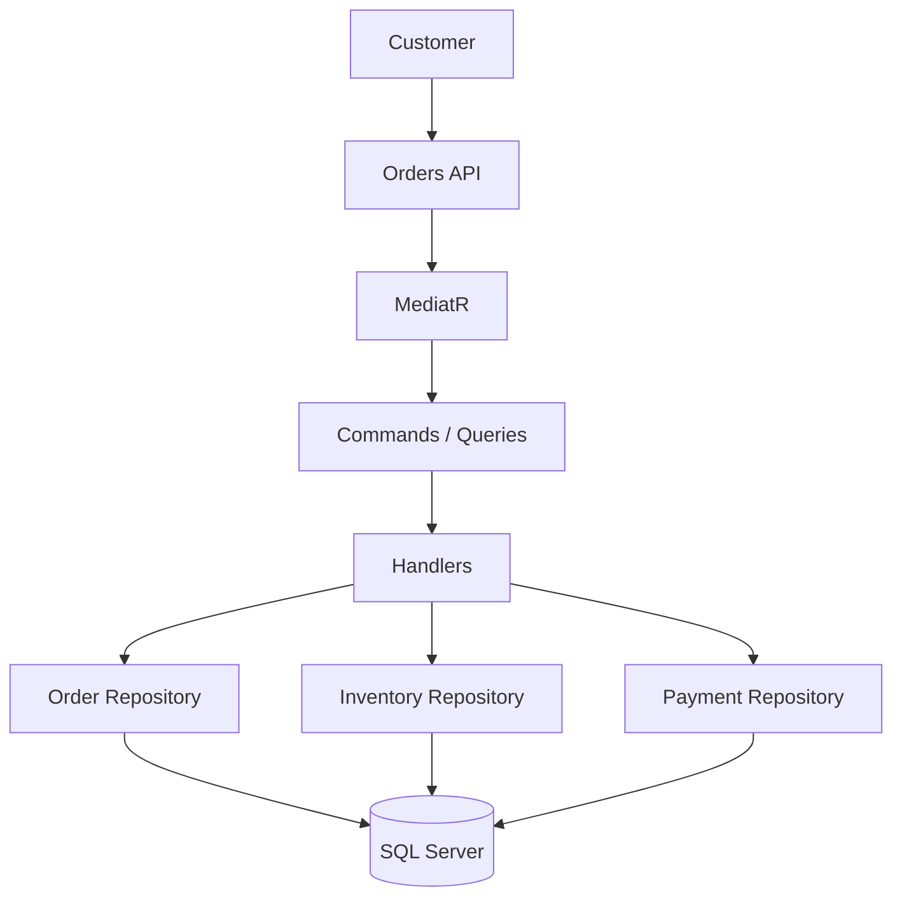
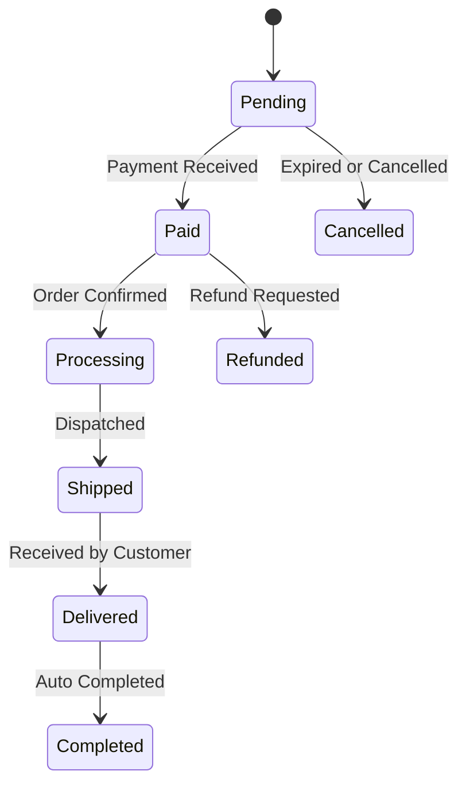
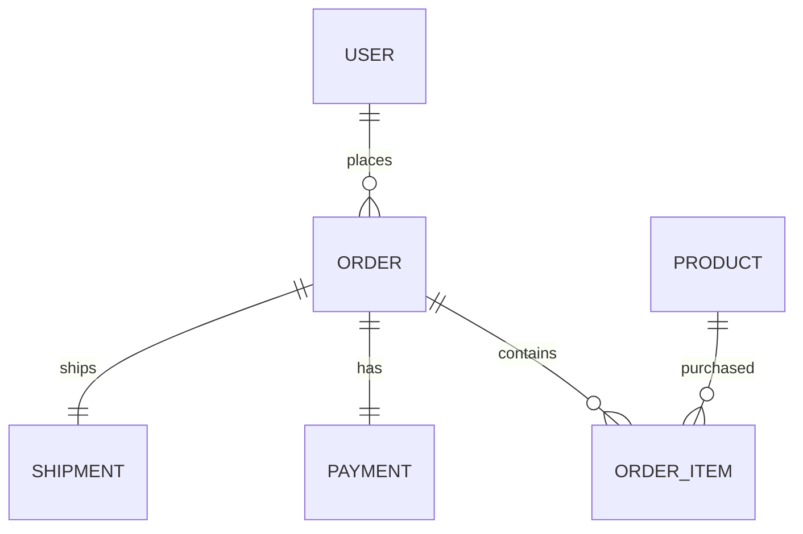
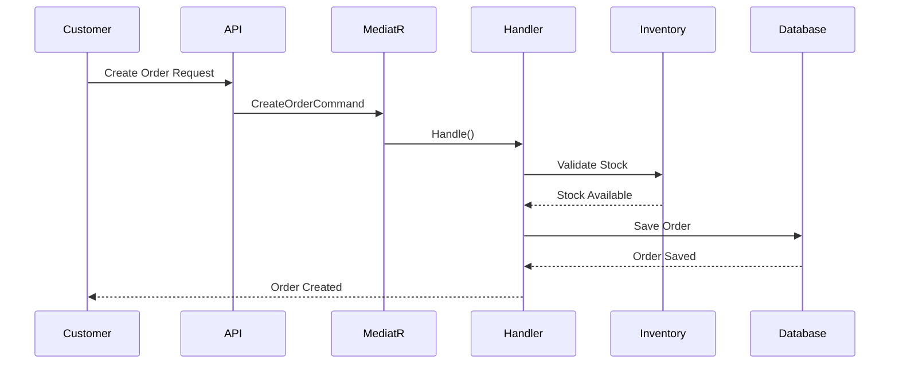
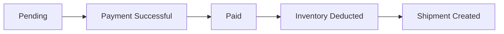
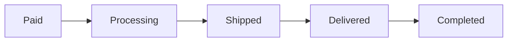
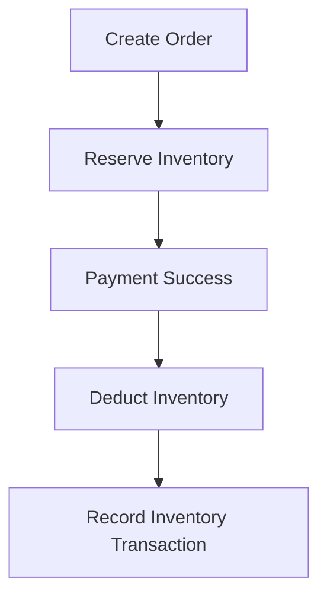
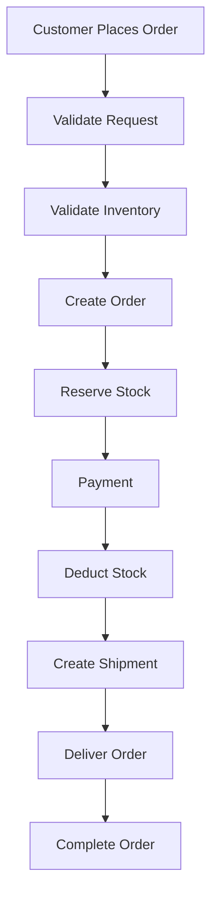

# Orders

The Orders module manages the complete order lifecycle — from order creation through payment, shipment, delivery, and completion. It coordinates with the Catalog, Inventory, Payment, and Notification modules to ensure a consistent and reliable purchasing experience.

---

## Table of Contents

- [Features](#features)
- [Module Overview](#module-overview)
- [Order Lifecycle](#order-lifecycle)
- [Order Entity](#order-entity)
- [Order Item Entity](#order-item-entity)
- [Entity Relationship](#entity-relationship)
- [Order Creation Flow](#order-creation-flow)
- [Payment Flow](#payment-flow)
- [Shipment Flow](#shipment-flow)
- [Background Jobs](#background-jobs)
- [CQRS Commands](#cqrs-commands)
- [Queries](#queries)
- [Business Rules](#business-rules)
- [Status Definitions](#status-definitions)
- [Inventory Integration](#inventory-integration)
- [Notifications](#notifications)
- [API Endpoints](#api-endpoints)
- [Error Scenarios](#error-scenarios)
- [Complete Order Workflow](#complete-order-workflow)
- [Current Capabilities](#current-capabilities)
- [Planned Enhancements](#planned-enhancements)
- [Technologies](#technologies)

---

## Features

| Feature | Status |
|---|:---:|
| Order Creation | ✅ |
| Multiple Order Items | ✅ |
| Order Status Tracking | ✅ |
| Inventory Reservation | ✅ |
| Payment Integration | ✅ |
| Shipment Tracking | ✅ |
| Order Completion | ✅ |
| Order Cancellation | ✅ |
| Background Job Support | ✅ |
| CQRS Architecture | ✅ |

---

## Module Overview

---

## Order Lifecycle

---

## Order Entity

| Property | Description |
|---|---|
| **Id** | Order identifier |
| **OrderNumber** | Unique order reference number |
| **UserId** | Customer who placed the order |
| **Status** | Current order status |
| **SubTotal** | Total before discounts |
| **Discount** | Applied discount amount |
| **Total** | Final payable amount |
| **CreatedOn** | Order creation date |
| **ModifiedOn** | Last update date |

---

## Order Item Entity

Each order contains one or more order items.

| Property | Description |
|---|---|
| **Id** | Order item identifier |
| **OrderId** | Parent order reference |
| **ProductId** | Purchased product reference |
| **ProductName** | Product name snapshot at time of purchase |
| **Quantity** | Purchased quantity |
| **UnitPrice** | Unit price at time of purchase |
| **Total** | Quantity × Unit Price |

---

## Entity Relationship

---

## Order Creation Flow

---

## Payment Flow

---

## Shipment Flow

---

## Background Jobs

The Orders module includes automated background jobs for order lifecycle management.

| Job | Schedule | Purpose |
|---|:---:|---|
| `CancelExpiredOrdersJob` | Every Minute | Cancels unpaid orders past the expiration period |
| `CompleteDeliveredOrdersJob` | Daily | Marks delivered orders as completed automatically |

---

## CQRS Commands

| Command | Description |
|---|---|
| `CreateOrderCommand` | Creates a new customer order |
| `CancelOrderCommand` | Cancels an existing order |
| `CompleteDeliveredOrdersCommand` | Marks delivered orders as completed |
| `CancelExpiredOrdersCommand` | Cancels all unpaid expired orders |

---

## Queries

| Query | Description |
|---|---|
| `GetOrderByIdQuery` | Retrieves a specific order by ID |
| `GetOrdersQuery` | Retrieves all orders |
| `GetCurrentUserOrdersQuery` | Retrieves all orders for the authenticated user |

---

## Business Rules

| Rule | Description |
|---|---|
| **Customer Must Exist** | Order cannot be created for unknown users |
| **Product Must Exist** | Order items must reference valid products |
| **Stock Must Be Available** | Inventory is validated before order creation |
| **Items Required** | An order must contain at least one item |
| **Payment Before Shipping** | Payment must be confirmed before dispatching |
| **Completed Orders Locked** | Completed orders cannot be modified |
| **Cancelled Orders Locked** | Cancelled orders cannot be shipped |

---

## Status Definitions

| Status | Description |
|---|---|
| **Pending** | Order created, waiting for payment |
| **Paid** | Payment received and confirmed |
| **Processing** | Order confirmed, preparing for shipment |
| **Shipped** | Order dispatched to customer |
| **Delivered** | Order received by customer |
| **Completed** | Automatically completed after delivery |
| **Cancelled** | Cancelled by customer or system |
| **Refunded** | Payment refunded to customer |

---

## Inventory Integration

---

## Notifications

Customers receive background email notifications for the following order events:

| Event | Notification |
|---|---|
| **Order Created** | Order confirmation email |
| **Payment Successful** | Payment confirmation email |
| **Shipment Created** | Shipment dispatched notification |
| **Order Delivered** | Delivery confirmation email |
| **Order Completed** | Order completion summary |

---

## API Endpoints

| Method | Endpoint | Description |
|:---:|---|---|
| `POST` | `/api/orders` | Create a new order |
| `GET` | `/api/orders` | Retrieve all orders |
| `GET` | `/api/orders/{id}` | Retrieve order by ID |
| `PUT` | `/api/orders/{id}/cancel` | Cancel an order |
| `GET` | `/api/orders/me` | Retrieve current user orders |

---

## Error Scenarios

| Error Code | Description |
|---|---|
| `PRODUCT_NOT_FOUND` | Referenced product does not exist |
| `INSUFFICIENT_STOCK` | Not enough inventory available |
| `INVALID_ORDER` | Order failed validation rules |
| `PAYMENT_REQUIRED` | Payment is missing or incomplete |
| `ORDER_NOT_FOUND` | Referenced order does not exist |

---

## Complete Order Workflow

---

## Current Capabilities

| Capability | Status |
|---|:---:|
| Create Orders | ✅ |
| Multiple Order Items | ✅ |
| Inventory Reservation | ✅ |
| Payment Integration | ✅ |
| Shipment Tracking | ✅ |
| Order Status Management | ✅ |
| Automatic Completion | ✅ |
| Automatic Cancellation | ✅ |
| Background Jobs | ✅ |

---

## Planned Enhancements

| Feature | Status |
|---|:---:|
| Coupon Engine | 📅 Planned |
| Tax Calculation | 📅 Planned |
| Split Payments | 📅 Planned |
| Multiple Shipping Addresses | 📅 Planned |
| Partial Shipments | 📅 Planned |
| Partial Refunds | 📅 Planned |
| Return Management (RMA) | 📅 Planned |
| Exchange Orders | 📅 Planned |
| Invoice Generation | 📅 Planned |
| Order Timeline | 📅 Planned |
| Order Analytics Dashboard | 📅 Planned |

---

## Technologies

| Category | Technology |
|---|---|
| **Framework** | ASP.NET Core 8 |
| **ORM** | Entity Framework Core |
| **Database** | SQL Server |
| **Mediator** | MediatR |
| **Background Jobs** | Hangfire |
| **Architecture** | Clean Architecture |
| **Pattern** | CQRS · Repository Pattern |
| **Validation** | FluentValidation |
| **Logging** | Serilog |

---

  Built with precision · Engineered for scale · Designed for clarity

