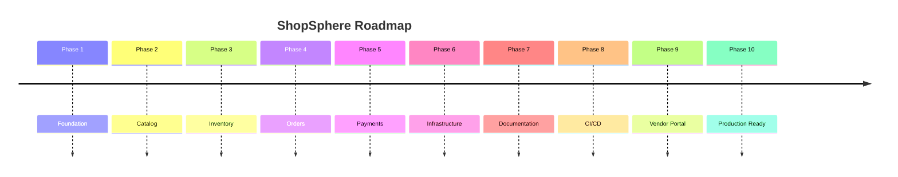
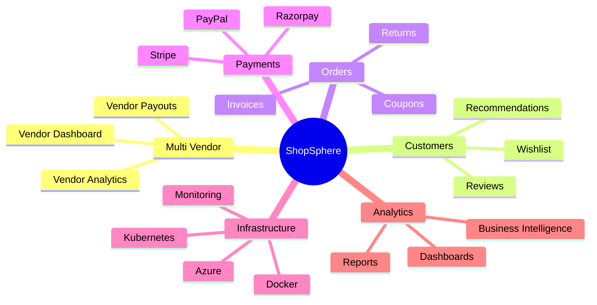

# Roadmap

The ShopSphere roadmap outlines the planned evolution of the platform. The project is being developed incrementally using Clean Architecture, CQRS, and modern .NET development practices.

---

# Vision

Build a scalable, production-ready, multi-vendor e-commerce backend that demonstrates enterprise architecture, modern engineering practices, and cloud-native deployment.

---

# Development Timeline

---

# Current Progress

| Module | Status |
|----------|:------:|
| Clean Architecture | ✅ |
| Authentication | ✅ |
| Categories | ✅ |
| Brands | ✅ |
| Products | ✅ |
| Product Images | ✅ |
| Inventory | ✅ |
| Orders | ✅ |
| Payments | ✅ |
| Email Notifications | ✅ |
| Background Jobs | ✅ |
| Hangfire | ✅ |
| Health Checks | ✅ |
| Logging | ✅ |
| Unit Tests | ✅ |
| Infrastructure Tests | ✅ |
| Architecture Tests | ✅ |
| GitHub Actions | ✅ |
| Documentation | ✅ |
| Integration Tests | 🚧 |

---

# Phase 1 — Foundation ✅

Completed

- Clean Architecture
- CQRS
- MediatR
- Repository Pattern
- Result Pattern
- Dependency Injection
- Global Exception Middleware
- Logging
- JWT Authentication

---

# Phase 2 — Product Catalog ✅

Completed

- Categories
- Brands
- Products
- Product Images
- Search
- Pagination
- Filtering

---

# Phase 3 — Inventory ✅

Completed

- Inventory Management
- Stock Updates
- Inventory Transactions
- Reservation
- Validation

---

# Phase 4 — Orders ✅

Completed

- Order Creation
- Order Items
- Order Status
- Shipment
- Completion
- Cancellation

---

# Phase 5 — Payments ✅

Completed

- Payment Entity
- Payment Tracking
- Payment Success Flow
- Payment Notifications

---

# Phase 6 — Infrastructure ✅

Completed

- Email Templates
- Notification Service
- Hangfire
- Background Jobs
- Health Checks
- Redis Support
- Serilog

---

# Phase 7 — Documentation ✅

Completed

- README
- Architecture
- Authentication
- Catalog
- Inventory
- Orders
- Background Jobs
- Testing
- Deployment
- Roadmap

---

# Phase 8 — CI/CD ✅

Completed

- GitHub Actions
- Build Automation
- Unit Tests
- Coverage Reports
- Build Artifacts

---

# Phase 9 — Vendor Portal 🚧

Planned features:

- Vendor Registration
- Vendor Dashboard
- Product Management
- Vendor Inventory
- Vendor Analytics
- Vendor Orders
- Vendor Payouts

---

# Phase 10 — Production Ready 🚧

Planned improvements:

- Docker
- Docker Compose
- Kubernetes
- Azure Deployment
- Redis Cache
- Distributed Cache
- API Versioning
- API Documentation Portal
- Performance Optimization
- Production Monitoring

---

# Future Features

## Customer

- Wishlist
- Product Reviews
- Product Ratings
- Recently Viewed
- Product Recommendations
- Saved Addresses
- Multiple Shipping Addresses

---

## Orders

- Coupons
- Gift Cards
- Partial Refunds
- Partial Shipments
- Exchanges
- Returns (RMA)
- Invoice PDF
- Order Timeline

---

## Payments

- Stripe
- Razorpay
- PayPal
- Webhooks
- Refunds
- Subscription Payments

---

## Search

- Elasticsearch
- Full-text Search
- Search Suggestions
- Popular Searches

---

## Performance

- Response Caching
- Distributed Cache
- Background Processing
- Query Optimization
- Read Replicas

---

## Security

- Refresh Tokens
- MFA Authentication
- Account Lockout
- Device Management
- Audit Logs
- Security Headers

---

## Administration

- Admin Dashboard
- User Management
- Role Management
- Audit Viewer
- Sales Dashboard
- Analytics

---

## Reporting

- Sales Reports
- Inventory Reports
- Vendor Reports
- Customer Reports
- Revenue Dashboard

---

# Long-Term Vision

---

# Project Goals

- Enterprise-grade architecture
- High test coverage
- Cloud-ready deployment
- Clean and maintainable codebase
- Comprehensive documentation
- Automated CI/CD
- Production-ready scalability

---

# Technologies

- ASP.NET Core 8
- Entity Framework Core
- SQL Server
- Redis
- Hangfire
- MediatR
- FluentValidation
- Serilog
- xUnit
- GitHub Actions
- Docker *(Planned)*
- Kubernetes *(Planned)*
- Azure *(Planned)*

---

# Current Project Status

**Overall Completion:** **~90%**

Remaining major milestones:

- Complete Integration Tests
- Docker & Docker Compose
- Kubernetes Deployment
- Vendor Portal
- Advanced Payment Gateways
- Performance Optimization
- Monitoring & Observability
- Production Release (v1.0)