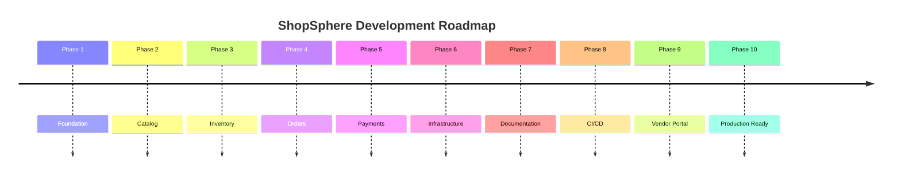
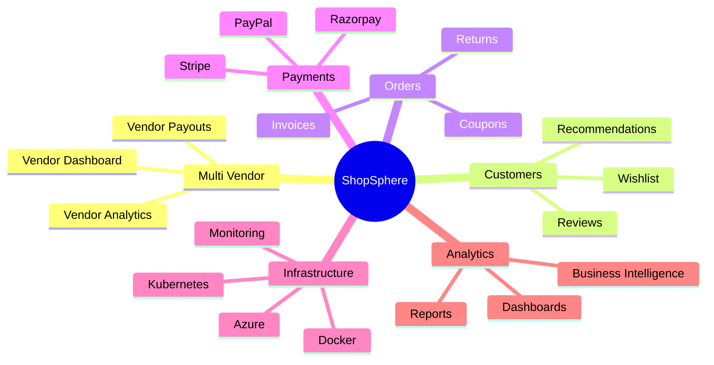

# Roadmap

The ShopSphere roadmap outlines the planned evolution of the platform. The project is being developed incrementally using Clean Architecture, CQRS, and modern .NET development practices.

---

## Table of Contents

- [Vision](#vision)
- [Development Timeline](#development-timeline)
- [Current Progress](#current-progress)
- [Phase 1 — Foundation](#phase-1--foundation-)
- [Phase 2 — Product Catalog](#phase-2--product-catalog-)
- [Phase 3 — Inventory](#phase-3--inventory-)
- [Phase 4 — Orders](#phase-4--orders-)
- [Phase 5 — Payments](#phase-5--payments-)
- [Phase 6 — Infrastructure](#phase-6--infrastructure-)
- [Phase 7 — Documentation](#phase-7--documentation-)
- [Phase 8 — CICD](#phase-8--cicd-)
- [Phase 9 — Vendor Portal](#phase-9--vendor-portal-)
- [Phase 10 — Production Ready](#phase-10--production-ready-)
- [Future Features](#future-features)
- [Long-Term Vision](#long-term-vision)
- [Project Goals](#project-goals)
- [Technologies](#technologies)
- [Current Project Status](#current-project-status)

---

## Vision

Build a scalable, production-ready, multi-vendor e-commerce backend that demonstrates enterprise architecture, modern engineering practices, and cloud-native deployment.

---

## Development Timeline

---

## Current Progress

| Module | Status |
|---|:---:|
| Clean Architecture | ✅ |
| Authentication | ✅ |
| Categories | ✅ |
| Brands | ✅ |
| Products | ✅ |
| Product Images | ✅ |
| Inventory | ✅ |
| Orders | ✅ |
| Payments | ✅ |
| Email Notifications | ✅ |
| Background Jobs | ✅ |
| Hangfire | ✅ |
| Health Checks | ✅ |
| Logging | ✅ |
| Unit Tests | ✅ |
| Infrastructure Tests | ✅ |
| Architecture Tests | ✅ |
| GitHub Actions | ✅ |
| Documentation | ✅ |
| Integration Tests | 🚧 In Progress |

---

## Phase 1 — Foundation ✅

| Feature | Status |
|---|:---:|
| Clean Architecture | ✅ |
| CQRS | ✅ |
| MediatR | ✅ |
| Repository Pattern | ✅ |
| Result Pattern | ✅ |
| Dependency Injection | ✅ |
| Global Exception Middleware | ✅ |
| Logging | ✅ |
| JWT Authentication | ✅ |

---

## Phase 2 — Product Catalog ✅

| Feature | Status |
|---|:---:|
| Categories | ✅ |
| Brands | ✅ |
| Products | ✅ |
| Product Images | ✅ |
| Search | ✅ |
| Pagination | ✅ |
| Filtering | ✅ |

---

## Phase 3 — Inventory ✅

| Feature | Status |
|---|:---:|
| Inventory Management | ✅ |
| Stock Updates | ✅ |
| Inventory Transactions | ✅ |
| Reservation | ✅ |
| Validation | ✅ |

---

## Phase 4 — Orders ✅

| Feature | Status |
|---|:---:|
| Order Creation | ✅ |
| Order Items | ✅ |
| Order Status | ✅ |
| Shipment | ✅ |
| Completion | ✅ |
| Cancellation | ✅ |

---

## Phase 5 — Payments ✅

| Feature | Status |
|---|:---:|
| Payment Entity | ✅ |
| Payment Tracking | ✅ |
| Payment Success Flow | ✅ |
| Payment Notifications | ✅ |

---

## Phase 6 — Infrastructure ✅

| Feature | Status |
|---|:---:|
| Email Templates | ✅ |
| Notification Service | ✅ |
| Hangfire | ✅ |
| Background Jobs | ✅ |
| Health Checks | ✅ |
| Redis Support | ✅ |
| Serilog | ✅ |

---

## Phase 7 — Documentation ✅

| Document | Status |
|---|:---:|
| README | ✅ |
| Architecture | ✅ |
| Authentication | ✅ |
| Catalog | ✅ |
| Inventory | ✅ |
| Orders | ✅ |
| Background Jobs | ✅ |
| Testing | ✅ |
| Deployment | ✅ |
| Roadmap | ✅ |

---

## Phase 8 — CI/CD ✅

| Feature | Status |
|---|:---:|
| GitHub Actions | ✅ |
| Build Automation | ✅ |
| Unit Tests | ✅ |
| Coverage Reports | ✅ |
| Build Artifacts | ✅ |

---

## Phase 9 — Vendor Portal 🚧

| Feature | Status |
|---|:---:|
| Vendor Registration | 📅 Planned |
| Vendor Dashboard | 📅 Planned |
| Product Management | 📅 Planned |
| Vendor Inventory | 📅 Planned |
| Vendor Analytics | 📅 Planned |
| Vendor Orders | 📅 Planned |
| Vendor Payouts | 📅 Planned |

---

## Phase 10 — Production Ready 🚧

| Feature | Status |
|---|:---:|
| Docker | 📅 Planned |
| Docker Compose | 📅 Planned |
| Kubernetes | 📅 Planned |
| Azure Deployment | 📅 Planned |
| Redis Cache | 📅 Planned |
| Distributed Cache | 📅 Planned |
| API Versioning | 📅 Planned |
| API Documentation Portal | 📅 Planned |
| Performance Optimization | 📅 Planned |
| Production Monitoring | 📅 Planned |

---

## Future Features

### Customer

| Feature | Status |
|---|:---:|
| Wishlist | 📅 Planned |
| Product Reviews | 📅 Planned |
| Product Ratings | 📅 Planned |
| Recently Viewed | 📅 Planned |
| Product Recommendations | 📅 Planned |
| Saved Addresses | 📅 Planned |
| Multiple Shipping Addresses | 📅 Planned |

### Orders

| Feature | Status |
|---|:---:|
| Coupons | 📅 Planned |
| Gift Cards | 📅 Planned |
| Partial Refunds | 📅 Planned |
| Partial Shipments | 📅 Planned |
| Exchanges | 📅 Planned |
| Returns (RMA) | 📅 Planned |
| Invoice PDF | 📅 Planned |
| Order Timeline | 📅 Planned |

### Payments

| Feature | Status |
|---|:---:|
| Stripe | 📅 Planned |
| Razorpay | 📅 Planned |
| PayPal | 📅 Planned |
| Webhooks | 📅 Planned |
| Refunds | 📅 Planned |
| Subscription Payments | 📅 Planned |

### Search

| Feature | Status |
|---|:---:|
| Elasticsearch | 📅 Planned |
| Full-text Search | 📅 Planned |
| Search Suggestions | 📅 Planned |
| Popular Searches | 📅 Planned |

### Performance

| Feature | Status |
|---|:---:|
| Response Caching | 📅 Planned |
| Distributed Cache | 📅 Planned |
| Background Processing | 📅 Planned |
| Query Optimization | 📅 Planned |
| Read Replicas | 📅 Planned |

### Security

| Feature | Status |
|---|:---:|
| Refresh Tokens | 📅 Planned |
| MFA Authentication | 📅 Planned |
| Account Lockout | 📅 Planned |
| Device Management | 📅 Planned |
| Audit Logs | 📅 Planned |
| Security Headers | 📅 Planned |

### Administration

| Feature | Status |
|---|:---:|
| Admin Dashboard | 📅 Planned |
| User Management | 📅 Planned |
| Role Management | 📅 Planned |
| Audit Viewer | 📅 Planned |
| Sales Dashboard | 📅 Planned |
| Analytics | 📅 Planned |

### Reporting

| Feature | Status |
|---|:---:|
| Sales Reports | 📅 Planned |
| Inventory Reports | 📅 Planned |
| Vendor Reports | 📅 Planned |
| Customer Reports | 📅 Planned |
| Revenue Dashboard | 📅 Planned |

---

## Long-Term Vision

---

## Project Goals

| Goal | Description |
|---|---|
| **Enterprise Architecture** | Clean Architecture · CQRS · DDD principles |
| **High Test Coverage** | Unit · Integration · Architecture tests |
| **Cloud-Ready Deployment** | Docker · Kubernetes · Azure support |
| **Clean Codebase** | SOLID · Maintainable · Well-structured |
| **Comprehensive Docs** | Every module fully documented |
| **Automated CI/CD** | GitHub Actions build and test pipeline |
| **Production Scalability** | Horizontal scaling · Redis · Health checks |

---

## Technologies

| Category | Technology |
|---|---|
| **Framework** | ASP.NET Core 8 |
| **ORM** | Entity Framework Core |
| **Database** | SQL Server |
| **Cache** | Redis |
| **Background Jobs** | Hangfire |
| **Mediator** | MediatR |
| **Validation** | FluentValidation |
| **Logging** | Serilog |
| **Testing** | xUnit |
| **CI/CD** | GitHub Actions |
| **Containerization** | Docker _(Planned)_ |
| **Orchestration** | Kubernetes _(Planned)_ |
| **Cloud** | Azure _(Planned)_ |

---

## Current Project Status

> **Overall Completion: ~90%**

| Milestone | Status |
|---|:---:|
| Complete Integration Tests | 🚧 In Progress |
| Docker & Docker Compose | 📅 Planned |
| Kubernetes Deployment | 📅 Planned |
| Vendor Portal | 📅 Planned |
| Advanced Payment Gateways | 📅 Planned |
| Performance Optimization | 📅 Planned |
| Monitoring & Observability | 📅 Planned |
| Production Release (v1.0) | 📅 Planned |

---

  Built with precision · Engineered for scale · Designed for clarity

