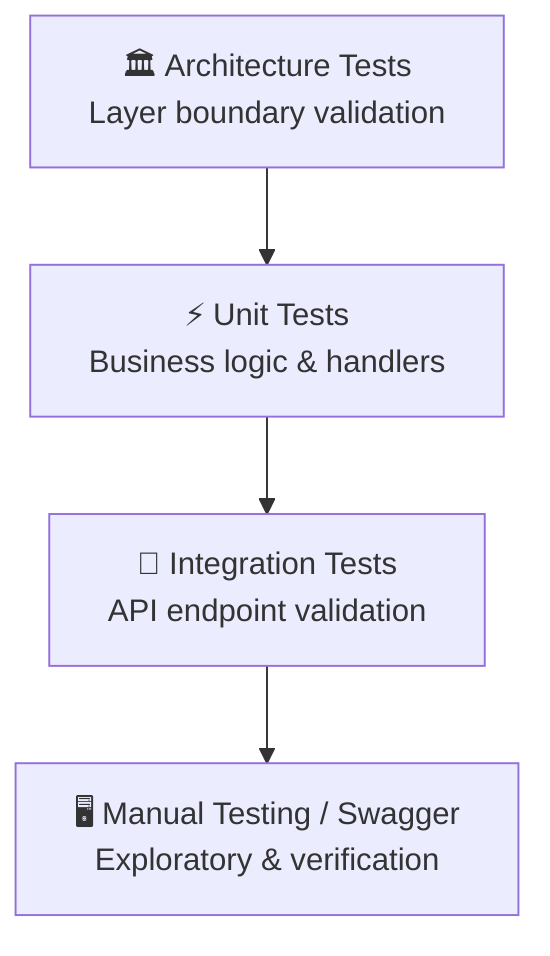
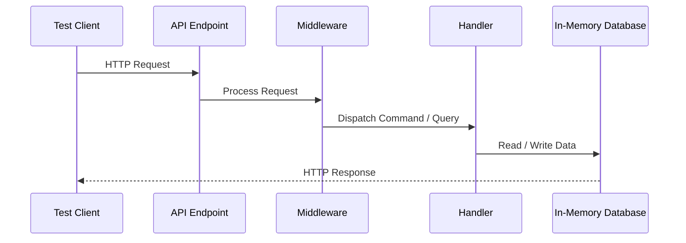
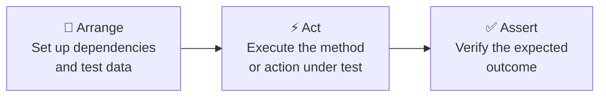
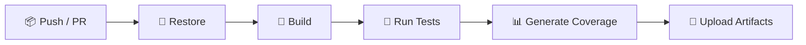
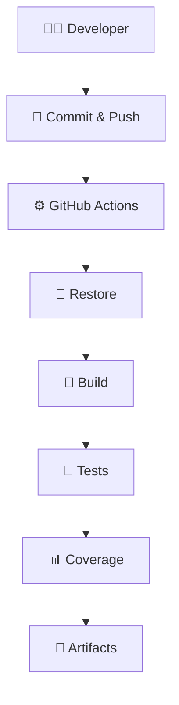

# Testing

ShopSphere follows a layered testing strategy to ensure reliability, maintainability, and confidence during development. Tests are organized by project and validate business logic, infrastructure, architecture, and API behavior.

---

## Table of Contents

- [Testing Strategy](#testing-strategy)
- [Test Projects](#test-projects)
- [Project Responsibilities](#project-responsibilities)
- [Unit Tests](#unit-tests)
- [Application Tests](#application-tests)
- [Infrastructure Tests](#infrastructure-tests)
- [Integration Tests](#integration-tests)
- [Architecture Tests](#architecture-tests)
- [Mocking](#mocking)
- [Assertions](#assertions)
- [Test Naming Convention](#test-naming-convention)
- [Test Structure](#test-structure)
- [Code Coverage](#code-coverage)
- [Continuous Integration](#continuous-integration)
- [GitHub Actions](#github-actions)
- [Testing Workflow](#testing-workflow)
- [Current Test Coverage](#current-test-coverage)
- [Best Practices](#best-practices)
- [Planned Improvements](#planned-improvements)
- [Technologies](#technologies)

---

## Testing Strategy

The solution uses four levels of testing to ensure complete coverage across all layers.



---

## Test Projects

```text
tests/
│
├── ShopSphere.ApplicationTests      # Unit tests — Handlers, Validators, Business Logic
├── ShopSphere.InfrastructureTests   # Infrastructure service tests
├── ShopSphere.IntegrationTests      # End-to-end API tests
└── ShopSphere.ArchitectureTests     # Architecture boundary enforcement tests
```

---

## Project Responsibilities

| Project | Purpose |
|---|---|
| **ApplicationTests** | Validates business logic, command handlers, query handlers, and validators |
| **InfrastructureTests** | Tests infrastructure services such as email, JWT, and background jobs |
| **IntegrationTests** | Verifies complete HTTP request pipelines end-to-end |
| **ArchitectureTests** | Enforces Clean Architecture layer dependency rules |

---

## Unit Tests

Unit tests validate isolated business logic without external dependencies.

| Area | Description |
|---|---|
| **Command Handlers** | Validates correct command processing |
| **Query Handlers** | Validates correct query responses |
| **Validators** | Ensures FluentValidation rules are enforced |
| **Domain Services** | Tests core domain business rules |
| **Result Objects** | Validates success and failure result patterns |
| **Business Rules** | Ensures all edge cases are handled correctly |

---

## Application Tests

| Module | Status |
|---|:---:|
| Authentication | ✅ |
| Categories | ✅ |
| Brands | ✅ |
| Products | ✅ |
| Inventory | ✅ |
| Orders | ✅ |
| Payments | ✅ |
| CQRS Handlers | ✅ |
| Validators | ✅ |
| Background Commands | ✅ |

---

## Infrastructure Tests

Infrastructure tests validate services that interact with external systems.

| Service | Status |
|---|:---:|
| JWT Token Provider | ✅ |
| Email Notification Service | ✅ |
| Email Template Renderer | ✅ |
| Background Jobs | ✅ |
| Hangfire Jobs | ✅ |
| Repository Helpers | ✅ |

---

## Integration Tests

Integration tests verify the complete HTTP request pipeline from endpoint to database.


## Architecture Tests

Architecture tests enforce Clean Architecture dependency rules to prevent layer violations.

| Rule | Description |
|---|---|
| **Application → Domain only** | Application layer must not reference Infrastructure |
| **Domain has no dependencies** | Domain layer has zero external references |
| **API → Application only** | API layer depends only on Application |
| **Handler contracts** | All handlers must implement `IRequestHandler` |
| **Repository abstractions** | Repository interfaces must remain inside Application |

---

## Mocking

External dependencies are mocked using **Moq** to keep unit tests fast and isolated.

| Mocked Service | Purpose |
|---|---|
| `IIdentityService` | Mocks user identity operations |
| `IRepository` | Mocks data access layer |
| `IMediator` | Mocks MediatR dispatching |
| `ILogger` | Mocks structured logging |
| `INotificationService` | Mocks notification dispatch |
| `IEmailService` | Mocks SMTP email delivery |
| `IBackgroundJobService` | Mocks Hangfire job scheduling |

---

## Assertions

All assertions are written using **FluentAssertions** for readable and expressive test output.

```csharp
result.IsSuccess.Should().BeTrue();

result.Value.Should().NotBeNull();

response.StatusCode.Should().Be(HttpStatusCode.Created);
```

---

## Test Naming Convention

Tests follow the **Arrange–Act–Assert (AAA)** pattern with a consistent naming convention.

**Format:**
```
MethodName_Should_ExpectedResult_WhenCondition
```

**Examples:**

```text
Handle_Should_CreateOrder_When_RequestIsValid

Handle_Should_ReturnFailure_When_ProductNotFound

ExecuteAsync_Should_LogWarning_When_JobFails
```

---

## Test Structure

Every test is structured using the **Arrange → Act → Assert** pattern:



---

## Code Coverage

Code coverage is automatically generated during the GitHub Actions CI pipeline.

| Layer | Coverage |
|---|:---:|
| Application | ✅ Included |
| Infrastructure | ✅ Included |
| Domain | ✅ Included |

**Generated report file:**

```
coverage.cobertura.xml
```

---

## Continuous Integration

Every push and pull request automatically triggers the full CI pipeline:



---

## GitHub Actions

| Step | Description |
|---|---|
| **Restore Packages** | Restores all NuGet dependencies |
| **Build Solution** | Compiles the entire solution |
| **Execute Unit Tests** | Runs all unit and application tests |
| **Execute Integration Tests** | Runs all API integration tests |
| **Upload Test Results** | Stores test results as pipeline artifacts |
| **Upload Coverage Reports** | Stores coverage report for review |

---

## Testing Workflow



---

## Current Test Coverage

### Application Layer

| Module | Status |
|---|:---:|
| Authentication | ✅ |
| Categories | ✅ |
| Brands | ✅ |
| Products | ✅ |
| Inventory | ✅ |
| Orders | ✅ |
| Payments | ✅ |

### Infrastructure Layer

| Service | Status |
|---|:---:|
| Email Service | ✅ |
| Email Templates | ✅ |
| JWT Provider | ✅ |
| Background Jobs | ✅ |

### Integration Layer

| Endpoint | Status |
|---|:---:|
| Register Endpoint | ✅ |
| Login Endpoint | 🚧 In Progress |
| Product APIs | 🚧 In Progress |
| Order APIs | 🚧 In Progress |

### Architecture Layer

| Rule | Status |
|---|:---:|
| Layer Dependency Rules | ✅ |
| Clean Architecture Validation | ✅ |

---

## Best Practices

| Practice | Description |
|---|---|
| **Single Assertion Target** | One logical assertion focus per test |
| **Mock Only Externals** | Only mock dependencies outside the system under test |
| **Deterministic Tests** | Tests must produce the same result on every run |
| **No Database in Unit Tests** | Use mocks — never real databases in unit tests |
| **Test Behavior** | Test what the code does, not how it does it |
| **AAA Pattern** | Always follow Arrange → Act → Assert consistently |

---

## Technologies

| Category | Technology |
|---|---|
| **Test Framework** | xUnit |
| **Assertions** | FluentAssertions |
| **Mocking** | Moq |
| **API Testing** | Microsoft.AspNetCore.Mvc.Testing |
| **Coverage** | Coverlet |
| **Architecture Testing** | NetArchTest |
| **Future** | Testcontainers |
| **CI/CD** | GitHub Actions |

---

<p align="center">
  <sub>Built with precision · Engineered for scale · Designed for clarity</sub>
</p>
