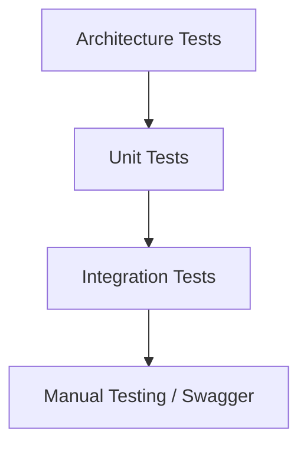

# Testing

ShopSphere follows a layered testing strategy to ensure reliability, maintainability, and confidence during development. Tests are organized by project and validate business logic, infrastructure, architecture, and API behavior.

---

# Testing Strategy

The solution uses four levels of testing:



---

# Test Projects

```text
tests/

├── ShopSphere.ApplicationTests
├── ShopSphere.InfrastructureTests
├── ShopSphere.IntegrationTests
└── ShopSphere.ArchitectureTests
```

---

# Project Responsibilities

| Project | Purpose |
|----------|----------|
| ApplicationTests | Business logic & handlers |
| InfrastructureTests | Infrastructure services |
| IntegrationTests | API endpoints |
| ArchitectureTests | Architecture validation |

---

# Unit Tests

Unit tests validate isolated business logic.

Covered areas include:

- Command Handlers
- Query Handlers
- Validators
- Domain Services
- Result Objects
- Business Rules

---

# Application Tests

Current coverage includes:

```text
Authentication

Categories

Brands

Products

Inventory

Orders

Payments

CQRS Handlers

Validators

Background Commands
```

---

# Infrastructure Tests

Infrastructure tests validate services that interact with external systems.

Current coverage:

- JWT Token Provider
- Email Notification Service
- Email Template Renderer
- Background Jobs
- Hangfire Jobs
- Repository Helpers

---

# Integration Tests

Integration tests verify complete HTTP request pipelines.

Example flow:

```mermaid
sequenceDiagram

Client->>API

API->>Middleware

Middleware->>Endpoint

Endpoint->>Handler

Handler->>Database

Database-->>Client
```

---

Current endpoint coverage:

- Register
- Login *(Planned)*
- Forgot Password *(Planned)*
- Email Verification *(Planned)*
- Products *(Planned)*
- Orders *(Planned)*

---

# Architecture Tests

Architecture tests ensure the solution follows Clean Architecture.

Examples:

- Application does not reference Infrastructure
- Domain has no external dependencies
- API depends on Application only
- Handlers implement IRequestHandler
- Repository interfaces remain inside Application

---

# Mocking

External dependencies are mocked using **Moq**.

Typical mocked services include:

- IIdentityService
- IRepository
- IMediator
- ILogger
- INotificationService
- IEmailService
- IBackgroundJobService

---

# Assertions

Assertions are written using **FluentAssertions**.

Example:

```csharp
result.IsSuccess.Should().BeTrue();

result.Value.Should().NotBeNull();

response.StatusCode.Should().Be(HttpStatusCode.Created);
```

---

# Test Naming Convention

Tests follow the Arrange–Act–Assert (AAA) pattern.

Recommended naming:

```text
Method_Should_ExpectedResult_WhenCondition
```

Examples:

```text
Handle_Should_Create_Order_When_Request_Is_Valid

Handle_Should_Return_Failure_When_Product_Not_Found

ExecuteAsync_Should_LogWarning_When_Job_Fails
```

---

# Test Structure

```text
Arrange

↓

Act

↓

Assert
```

---

# Code Coverage

Code coverage is generated during GitHub Actions.

Coverage includes:

- Application
- Infrastructure
- Domain

Generated report:

```text
coverage.cobertura.xml
```

---

# Continuous Integration

Every Pull Request executes:

```text
Restore

↓

Build

↓

Run Tests

↓

Generate Coverage

↓

Upload Artifacts
```

---

# GitHub Actions

Current CI pipeline performs:

- Restore Packages
- Build Solution
- Execute Unit Tests
- Execute Integration Tests
- Upload Test Results
- Upload Coverage Reports

---

# Testing Workflow

```mermaid
flowchart LR

Developer

↓

Commit

↓

GitHub Actions

↓

Restore

↓

Build

↓

Tests

↓

Coverage

↓

Artifacts
```

---

# Current Test Coverage

## Application

✅ Authentication

✅ Categories

✅ Brands

✅ Products

✅ Inventory

✅ Orders

✅ Payments

---

## Infrastructure

✅ Email Service

✅ Email Templates

✅ JWT Provider

✅ Background Jobs

---

## Integration

✅ Register Endpoint

🚧 Login Endpoint

🚧 Product APIs

🚧 Order APIs

---

## Architecture

✅ Layer Dependency Rules

✅ Clean Architecture Validation

---

# Best Practices

- One assertion target per test
- Mock only external dependencies
- Keep tests deterministic
- Avoid database dependencies in unit tests
- Test business behavior instead of implementation details
- Follow AAA pattern consistently

---

# Planned Improvements

Future enhancements include:

- 90%+ Code Coverage
- API Contract Tests
- Performance Tests
- Load Testing
- Security Testing
- End-to-End Tests
- Snapshot Testing
- Docker-based Integration Tests
- Testcontainers for SQL Server & Redis
- Mutation Testing

---

# Technologies

- xUnit
- FluentAssertions
- Moq
- ASP.NET Core Testing
- Microsoft.AspNetCore.Mvc.Testing
- Testcontainers
- GitHub Actions
- Coverlet